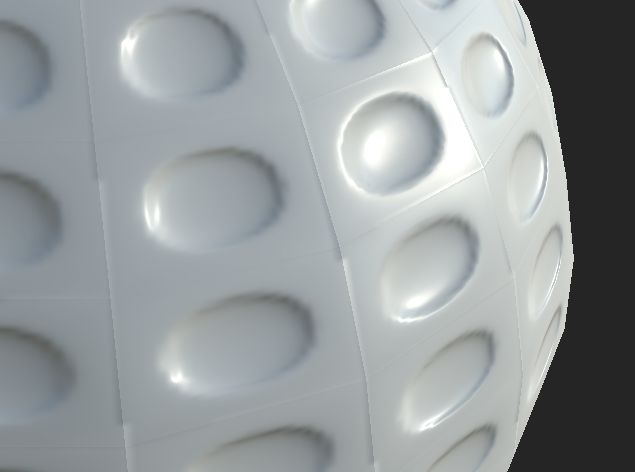

# Naht auf jedem Gesicht sichtbar

>[!WARNING]
>
> **Problem**
> 
> An einigen Kanten der Geometrie ist eine Naht sichtbar, auch wenn keine UV-Naht vorhanden ist:
> 
> 

>[!NOTE]
>
> **Erklärung**
> 
> Wenn kein [Käfig](https://helpx.adobe.com/de/substance-3d/unlisted/documentation/bake/cage-projection-172822982.html) verwendet wird, startet der Backvorgang Strahlen in Richtung der Scheitelpunktnormalen des Gitters mit geringer Poly-Polung. Wenn jede Scheitelpunktnormale geteilt ist (d. h., dass jede Fläche nicht dieselbe Scheitelpunktnormale wie die benachbarte Fläche hat), werden die Strahlen an den Kanten nicht in dieselbe Richtung gesendet. Dies führt zu einer Teilung, da die Informationen auf jeder Seite der Kanten unterschiedlich sind.
> 
> Dieses Problem wird auch durch Aliasing verstärkt, wie in [dieser Seite](../../common-issues/aliasing-on-uv-seams/aliasing-on-uv-seams.md) erläutert.

>[!NOTE]
>
> **Lösung**
> 
> Hier sind nur zwei Lösungen möglich:
> 
> * Verwenden Sie einen [Käfig](https://helpx.adobe.com/de/substance-3d/unlisted/documentation/bake/cage-projection-172822982.html), um die Strahlrichtung zu steuern, anstatt den Bäcker sie aus der Geometrie mit niedriger Poly berechnen zu lassen.
> * Fügen Sie die Scheitelpunktnormalen des Polygonnetzes zusammen (erweichen Sie sie/wenden Sie eine gemeinsame Glättungsgruppe an).
