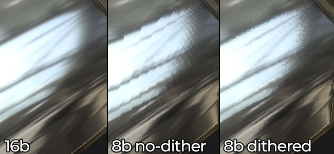

# Wird bei gebackenen Texturen Dithering angewendet?

>[!WARNING]
>
> **Frage**
> 
> Unterstützt der Baker die Textur [Dithering](https://en.wikipedia.org/wiki/Dither) und wenn ja, wann wird sie angewendet?

>[!NOTE]
>
> **Erklärung**
> 
> Dithering wird angewendet, um Streifenbildung in normalen 8-Bit-Maps zu vermeiden, z. B. :
> 
> 

>[!NOTE]
>
> **Lösung : Substance Designer**
> 
> In den folgenden Situationen wird das Dithering automatisch angewendet:
> 
> * Wenn eine Baker-Ausgabe in einer 8-Bit-Texturdatei gespeichert wird
> * Wenn eine Baker-Ausgabe in einem Bitmapknoten mit einem auf 8 Bit gesetzten Diagramm verwendet wird.

>[!NOTE]
>
> **Lösung : Substance Painter**
> 
> Dithering ist eine Option, die während des Exportvorgangs aktiviert oder deaktiviert werden kann. Es wird nur beim Export in das 8-Bit-Dateiformat für Normal, Versatz und Height angewendet.

>[!NOTE]
>
> **Lösung : Substance Automation Toolkit**
> 
> Dithering wird derzeit nicht unterstützt.
