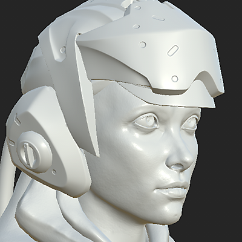
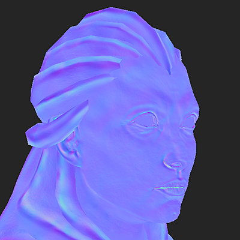

# Zuordnung nach Name

&quot;Namenskonform&quot; ist der Name einer Filtermethode, die in Substance Bakers verwendet werden kann, um Polyurethan-Maschen mit niedrigem und hohem Poly-Anteil auf der Grundlage ihres Namens zu isolieren.

Diese Funktion ist sehr nützlich, um zu vermeiden, dass beim Backen Geometrien übereinander verlaufen, um saubere Texturen zu erzielen. Es wird vermieden, dass Maschen entfernt werden müssen (oft als &quot;Explodieren&quot; bezeichnet), um dasselbe Ergebnis zu erzielen.

## Wann wird die Zuordnung nach Name verwendet?

### Normales Kartenbacken mit Gitterbluten

In diesem Beispiel verläuft der Helm, der sich oben auf dem Kopf der Figur befindet, über das Gesicht der Figur.

Durch Aktivieren von &quot;Passend nach Name&quot; können wir den Helm ignorieren und das Gesicht richtig backen. *Dieses Ergebnis basiert auf der Haupt-Match-Einstellung.*

| *Mesh* | *Übereinstimmung nach Name von* | *Übereinstimmung nach Name auf* |
| --- | --- | --- |
| {width="250px"} | {width="250px"} | {width="250px"} |

### Rückseite für schwebende Geometrie ignorieren

In diesem Beispiel sind die &quot;Schaltflächen&quot; am oberen Rand des Kastens schwebende Geometrie, sie sind nicht mit dem hohen Poly-Gitter verbunden. Daher werfen sie standardmäßig Schatten auf das Feld darunter, das den geometrischen Rahmen anzeigt.

Durch Aktivieren der Einstellung &quot;Abgleich nach Name&quot; für die Einstellung &quot;**Hintergrundfläche ignorieren**&quot; können wir die umgebende Verdeckung backen, während wir den Bereich unter den Schaltflächen ignorieren, damit er wie ein einzelnes Feld aussieht.*Dieses Ergebnis basiert auf der Verwendung der Einstellung &quot;Hintergrund ignorieren&quot;.*

| *Mesh* | *Übereinstimmung nach Name von* | *Übereinstimmung nach Name auf* |
| --- | --- | --- |
| {width="250px"} | {width="250px"} | {width="250px"} |

## Wie funktioniert die Zuordnung nach Namen?

Das System &quot;Matching By Name&quot; liest den Geometrienamen sowohl in den unteren als auch in den oberen Polygittern und verwendet ein Schlüsselwort (das Suffix), um die Namen zu identifizieren bzw. abzugleichen. Standardmäßig verwenden die Bäcker das spezifische Suffix, sie können jedoch geändert werden (siehe unten).

Folgende Suffixe werden derzeit unterstützt:

| *Suffixtyp* | *Standardwert* | *Nutzung* |
| --- | --- | --- |
| Hohe Poly | *\_high* | Wird verwendet, um den Namen des Gitters mit hohem Poly so zu isolieren, dass er mit dem Gitter mit niedrigem Poly übereinstimmt. |
| Niedriger Poly-Wert | *\_low* | Wird verwendet, um den Namen des Gitters mit niedrigem Poly zu isolieren, damit er mit dem Gitter mit hohem Poly übereinstimmt. |
| Rückseite ignorieren | *\_ignorebf* | Wird verwendet, um Rückseiten für Bäcker zu ignorieren, die Sekundärstrahlen verwenden, z. B. die Verdeckung &quot;Umgebung&quot;.*Dieses Suffix sollte nur auf den hohen Polymaschen vorhanden sein, z. B.:**mesh\_high\_ignorebf*** |

Einige Regeln, die zu berücksichtigen sind, damit diese Funktion ordnungsgemäß funktioniert:

* Die Zuordnung nach Name muss in [Allgemeine Parameter](../../bakers-settings/common-parameters/common-parameters.md) aktiviert sein, da sie standardmäßig **deaktiviert ist**.
* Eine sekundäre Einstellung für &quot;Abgleich nach Name&quot; kann in einigen Bäckern aktiviert sein (z. B. [Umgebungseinstellung](../../bakers-settings/ambient-occlusion-from/ambient-occlusion-from-mesh.md)), da sie Sekundärstrahlen erzeugen.
* Bei der Zuordnung wird die Groß- und Kleinschreibung berücksichtigt, d. h., ein Gitter mit dem Namen &quot;**Vela**&quot; stimmt nicht mit einem anderen mit dem Namen &quot;**Vela**&quot; überein.
* Je nachdem, wo sich das Suffix im Geometrienamen befindet, können mehrere Gitter zugeordnet werden.

Im Folgenden finden Sie Beispiele für die Funktionsweise der Zuordnung (unter Verwendung des Standardsuffixes):

| Name der niedrigen Gruppe | Passt zu hoher Poly-Rate | Entspricht nicht der hohen Poly |
| --- | --- | --- |
| <ul data-preserve-html="true"><li data-preserve-html="true">body_low</li></ul> | <ul data-preserve-html="true"><li data-preserve-html="true">body_high</li><li data-preserve-html="true">body_high_top</li><li data-preserve-html="true">body_high_1</li><li data-preserve-html="true">body_high_2</li></ul> | <ul data-preserve-html="true"><li data-preserve-html="true">körperbetont</li><li data-preserve-html="true">body_top_high</li></ul> |
| <ul data-preserve-html="true"><li data-preserve-html="true">Überschrift_niedrig</li></ul> | <ul data-preserve-html="true"><li data-preserve-html="true">Überschrift_hoch</li></ul> | <ul data-preserve-html="true"><li data-preserve-html="true">head_high</li></ul> |
| <ul data-preserve-html="true"><li data-preserve-html="true">Leg_low_top</li></ul> | <ul data-preserve-html="true"><li data-preserve-html="true">Bein_hoch</li><li data-preserve-html="true">Leg_high_top</li><li data-preserve-html="true">Leg_high_high_top</li></ul> | <ul data-preserve-html="true"><li data-preserve-html="true">Leg_top_high</li></ul> |

## Bäcker einrichten

### Aktivieren der Zuordnung nach Name

Die Zuordnung nach Name kann in den [allgemeinen Parametern](../../bakers-settings/common-parameters/common-parameters.md) der Baker-Einstellungen aktiviert werden:

| *Software* | *Konfiguration wird festgelegt* |
| --- | --- |
| **Substance Painter** | <ol class="steps" data-preserve-html="true"> <li class="step" data-preserve-html="true">     Öffnen Sie das Fenster &quot;Backen&quot; (über die Einstellungen für den Textursatz).    </li> <li class="step" data-preserve-html="true">     Zeigen Sie die allgemeinen Parameter an.    </li> <li class="step" data-preserve-html="true">     Ändern Sie die Einstellung &quot;<strong>Match</strong>&quot; von &quot;Always&quot; in &quot;By Mesh Name&quot;.      </li> </ol> |
| **Substance Designer** | <ol class="steps" data-preserve-html="true"> <li class="step" data-preserve-html="true">     Öffnen Sie das Backfenster (durch Klicken mit der rechten Maustaste auf ein verknüpftes Gitter im Explorer-Fenster).    </li> <li class="step" data-preserve-html="true">     Ändern Sie die Einstellung &quot;<strong>Match</strong>&quot; von &quot;Immer&quot; in &quot;Nach Gittername&quot;. 2       </li> </ol> |

### Ändern der Suffixnamen

Die Standardsuffixe lauten \_low und \_high und können wie folgt geändert werden:

* **Substance Painter**: Im [Sicherungsfenster](../../getting-started/software-interface/3d-painter/substance-3d-painter.md) innerhalb der allgemeinen Parameter.
* **Substance Designer**: In den [Projekteinstellungen](https://experienceleague.adobe.com/en/docs/substance-3d-designer/using/workspace/preferences/project-settings) unter den Backeinstellungen.

## High-Poly-Meshes von zBrush

Aus zBrush exportierte Gitter mit hohem Poly können mit der Funktion &quot;Matching by Name&quot; für das Backen verwendet werden. Es können jedoch einige Einstellungen vorgenommen werden:

| *Dateiformat* | *Beschreibung* |
| --- | --- |
| **FBX** | Es sind keine spezifischen Parameter zum Aktivieren/Deaktivieren vorhanden. Gitterdateien können unverändert verwendet werden. |
| **OBJ** | Von zBrush exportierte OBJ-Dateien funktionieren standardmäßig nicht mit &quot;**Matching By Name**&quot;. Stattdessen können Sie dem Substance Painter mitteilen, den Namen der Gitterdatei zu verwenden, anstatt die Gitter nach Namen abzugleichen.Gehen Sie hierzu wie folgt vor:<ol data-preserve-html="true"><li data-preserve-html="true"><strong>Deaktivieren Sie </strong> den Gruppenparameter (Grp) für <strong>jedes</strong>-Untertool.</li><li data-preserve-html="true"><strong>Benennen</strong> Sie die OBJ-Datei entsprechend (z. B.: <strong>body_high.obj</strong>).</li></ol>  |
