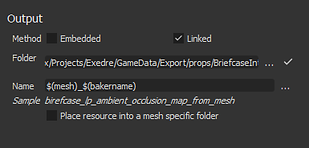

# Substance 3D Designer

Auf das Backing-Fenster kann über die Gitterdatei im Fenster [Explorer](https://helpx.adobe.com/de/substance-3d/unlisted/documentation/sddoc/the-explorer-129368147.html) zugegriffen werden. Klicken Sie mit der rechten Maustaste auf den Netznamen und wählen Sie &quot;**Informationen zum Backmodell**&quot; aus, um das Backing-Fenster zu öffnen.

## Überblick

{width="500px"}

Das Backfenster von ist in mehrere Paneele unterteilt, die im Folgenden beschrieben werden.

### Einzubrennendes Element

Dieses Bedienfeld steuert, welcher Teil des Gitters mit niedrigem Poly-Anteil zum Backen verwendet wird.

Dieses Bedienfeld listet die Geometrie in der Datei mit dem niedrigen Polygonnetz auf. Standardmäßig basiert die Liste auf den einzelnen Materialien, die in der Datei gefunden wurden, kann jedoch bei Bedarf auf Subnetze umgestellt werden. Sie können Elemente deaktivieren, die während des Backvorgangs ignoriert werden sollen.

### Ausgabe

Dieses Bedienfeld steuert, wo die Textur platziert wird.

| *Parameter* | *Beschreibung* |
| --- | --- |
| **Methode** | Steuert, wie die Texturen mit dem Substance-Paket gespeichert werden.Mögliche Werte:<ul data-preserve-html="true"><li data-preserve-html="true"><strong>Eingebettet</strong> : Die gebackenen Texturen werden in einem Unterordner neben dem Substance-Paket mit einem bestimmten Namen gespeichert.</li><li data-preserve-html="true"><strong>Verknüpft</strong> (Standard) : Die gebackene Textur wird in dem definierten Ordner gespeichert und dann in das Substance-Paket aufgenommen.</li></ul> |
| **Ordner** | Speicherort der Texturen, die als Stapel vorliegen. Klicken Sie auf drei Punkte, um ein Dateidialogfeld zu öffnen, und wählen Sie den Exportordner aus. Rechts wird ein Häkchen angezeigt, das angibt, ob der Ordner tatsächlich existiert oder nicht. |
| **Name** | Namenskonvention der gebackenen Texturen. Klicken Sie auf die Schaltfläche mit den drei Punkten, um eine Dropdown-Liste zu öffnen und andere Platzhalter einzufügen (Backname, benutzerdefiniert, Material, Gitter). |
| **Beispiel** | Simulieren Sie einen Dateinamen, um die Namenskonvention zu testen. |
| **Ressource in einen netzspezifischen Ordner platzieren** | Wenn diese Option aktiviert ist, werden die Texturen in einem Ordner gespeichert, der als Gitterdatei bezeichnet wird. |

### Hochauflösende Meshes

Dieses Bedienfeld steuert die Liste der Gitter mit hohem Poly-Wert und die zugehörigen Einstellungen. Weitere Informationen finden Sie in den [allgemeinen Parametern](../../../bakers-settings/common-parameters/common-parameters.md).

### Standardwerte

Weitere Informationen finden Sie in den [allgemeinen Parametern](../../../bakers-settings/common-parameters/common-parameters.md).

### Bäckerliste und -einstellungen

Im Bäcker kannst du die Textur auswählen, die du erzeugen möchtest. Standardmäßig ist die Liste leer.

* **Neuen Bäcker hinzufügen:** Klicken Sie auf die Schaltfläche &quot;Bäcker hinzufügen&quot;.
* **Einen Bäcker entfernen:** Wählen Sie den Bäcker in der Liste aus und klicken Sie dann auf die Schaltfläche &quot;Bäcker löschen&quot;.
* **Einen Bäcker nach oben verschieben:** Wählen Sie den Bäcker in der Liste aus und klicken Sie dann auf die Schaltfläche &quot;Nach oben ziehen&quot;.
* **Einen Bäcker nach unten bewegen:**&#x200B;Wählen Sie den Bäcker in der Liste aus und klicken Sie dann auf die Schaltfläche &quot;Nach unten drücken&quot;.

Jeder Bäcker in der erbt standardmäßig die Standardwerte (siehe oben). Die Größe (Auflösung) kann z.B. überschrieben werden, indem man auf die Zelle in der Zeile des Bäckers klickt. Dies gilt auch für die anderen Einstellungen in der Zeile.

Wenn Sie auf einen Bäcker in der Liste klicken, wird die Ansicht &quot;Bäckerparameter&quot; mit den spezifischen Parametern aktualisiert.

Weitere Informationen zu den spezifischen Parametern finden Sie unter: [Baker-Einstellungen](../../../bakers-settings/bakers-settings.md).
