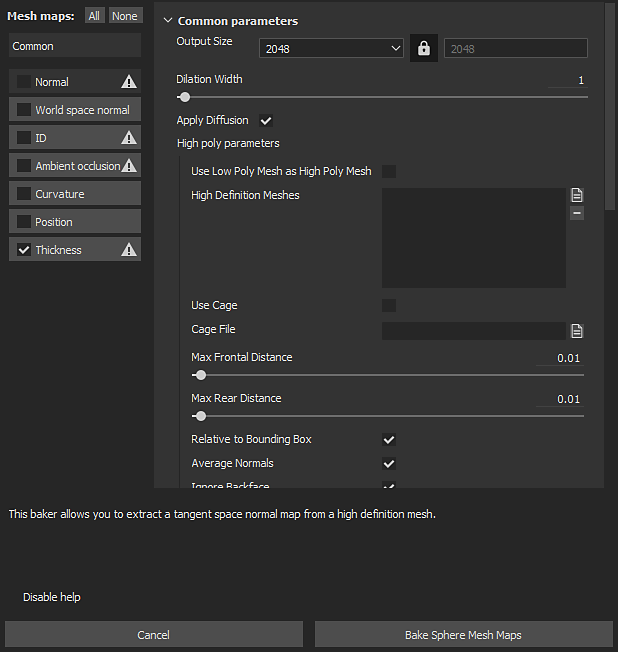

# Substance 3D Painter

Auf das Backing-Fenster kann über die [Textursatzeinstellungen](https://experienceleague.adobe.com/en/docs/substance-3d-painter/using/interface/texture-set/texture-set-settings) zugegriffen werden. Klicken Sie auf die Schaltfläche &quot;**Gitterzuordnungen backen**&quot;, um das Backing-Fenster des aktuellen Projekts zu öffnen.

## Überblick

{width="400px"}

Das Backfenster ist in drei Hauptkomponenten unterteilt.

### Bäckerliste

Links oben im Fenster befinden sich mehrere Schaltflächen.

Neben dieser Schaltfläche befindet sich ein Kontrollkästchen, das diese Backfunktion für den Backvorgang aktiviert, wenn es aktiviert ist. Die Schaltflächen mit einem Symbol neben dem Namen weisen auf die Schaltflächen hin, die ein Polygonnetz benötigen. Dieses Symbol zeigt eine Warnung an, wenn jetzt High-Poly verfügbar ist.

| *Schaltfläche* | *Beschreibung* |
| --- | --- |
| **Allgemein** | Ändern Sie die Parameteransicht in [Allgemeine Parameter](../../../bakers-settings/common-parameters/common-parameters.md). |
| **Normal** | Ändern Sie die Parameteransicht in die [normalen Parameter](../../../bakers-settings/normal-map-from-mesh/normal-map-from-mesh.md). |
| **Normaler Weltraum** | Ändern Sie die Parameteransicht in die Parameter [World Space Normal](../../../bakers-settings/world-space-normals/world-space-normals.md). |
| **ID** | Ändern Sie die Parameteransicht in die [Farbparameter](../../../bakers-settings/color-map-from-mesh/color-map-from-mesh.md). |
| **Umgebungs-Verdeckung** | Ändern Sie die Parameteransicht in die [Parameter für die Umgebungsgeräusche](../../../bakers-settings/ambient-occlusion-from/ambient-occlusion-from-mesh.md). Verdeckung: |
| **Krümmung** | Ändern Sie die Parameteransicht in [Kurvenparameter](../../../bakers-settings/curvature/curvature.md). |
| **Position** | Ändern Sie die Parameteransicht in die [Positionsparameter](../../../bakers-settings/position/position.md). |
| **Thickness** | Ändern Sie die Parameteransicht in die [Parameter für die Thickness](../../../bakers-settings/thickness-map-from-mesh/thickness-map-from-mesh.md). |
| **Height** | Ändern Sie die Parameteransicht in die [Height-Parameter](../../../bakers-settings/height-map-from-mesh/height-map-from-mesh.md). |
| **Gebeugte Normale** | Ändern Sie die Parameteransicht in die [Parameter für gebogene Normale](../../../bakers-settings/bent-normals-from-mesh/bent-normals-from-mesh.md). |
| **Deckkraft** | Ändern Sie die Parameteransicht in die [Deckkraftparameter](../../../bakers-settings/opacity-mask-from-mesh/opacity-mask-from-mesh.md). |

### Parameter

Dieser Teil des Fensters zeigt die verschiedenen Backeinstellungen an. Der Inhalt kann sich je nach derzeit ausgewähltem Bäcker oder allgemeinen Parametern ändern.

Weitere Informationen zu den Baker-Einstellungen finden Sie in den [Baker-Einstellungen](../../../bakers-settings/bakers-settings.md).

### Hilfemeldung

{width="500px"}

In diesem Teil des Fensters werden die verschiedenen QuickInfos und Hilfemeldungen zu den Einstellungen angezeigt. Bewegen Sie den Mauszeiger über eine Einstellung, um die QuickInfo hier zu lesen.
