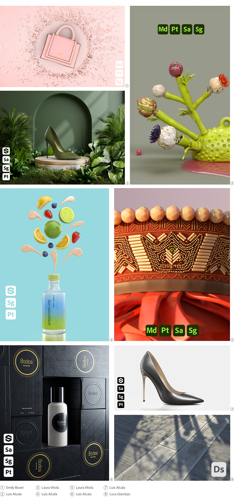

# Substance 3D-Icons für Künstler

<table>
  <tr style="border: 0;">
    <td style="border: 0;" valign="top"></td>
    <td style="border: 0;" valign="top"></td>
    <td style="border: 0;" valign="top"></td>
    <td style="border: 0;" valign="top"></td>
    <td style="border: 0;" valign="top"></td>
    <td style="border: 0;" valign="top"></td>
  </tr>
</table>

Künstler, die die Symbole von Substance 3D-Programmen in ihre veröffentlichten Grafiken einbinden möchten, können diese hier herunterladen. Die Bilder verwenden das SVG-Format, sodass sie in jeder Größe verwendet werden können.

[Laden Sie einen ZIP-Ordner herunter, der Farb-, Schwarz- und Weißversionen der Substance 3D-Applikationssymbole enthält.](../../assets/substance3d-icons.zip)

## Creative Cloud Library

Creative Cloud-Benutzer können über diese freigegebene Bibliothek in Creative Cloud-Anwendungen auf diese Symbole zugreifen:

[Substance 3D-Symbole](https://shared-assets.adobe.com/link/4c83a12c-3948-4151-5be1-ad75f4a64be0)

## Beispiele

