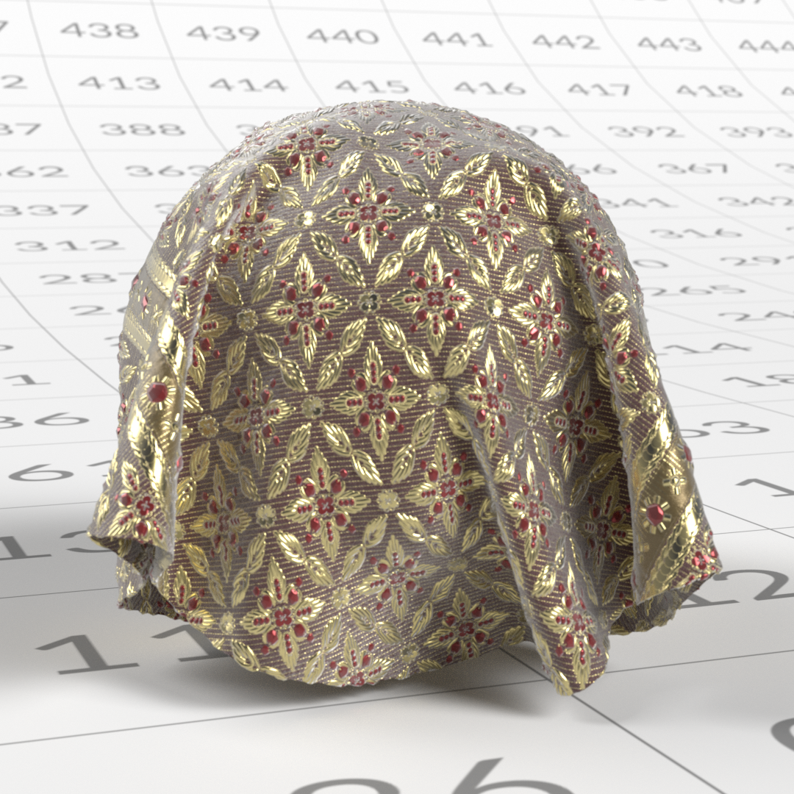
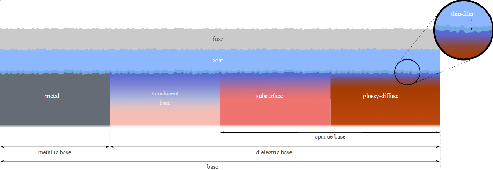
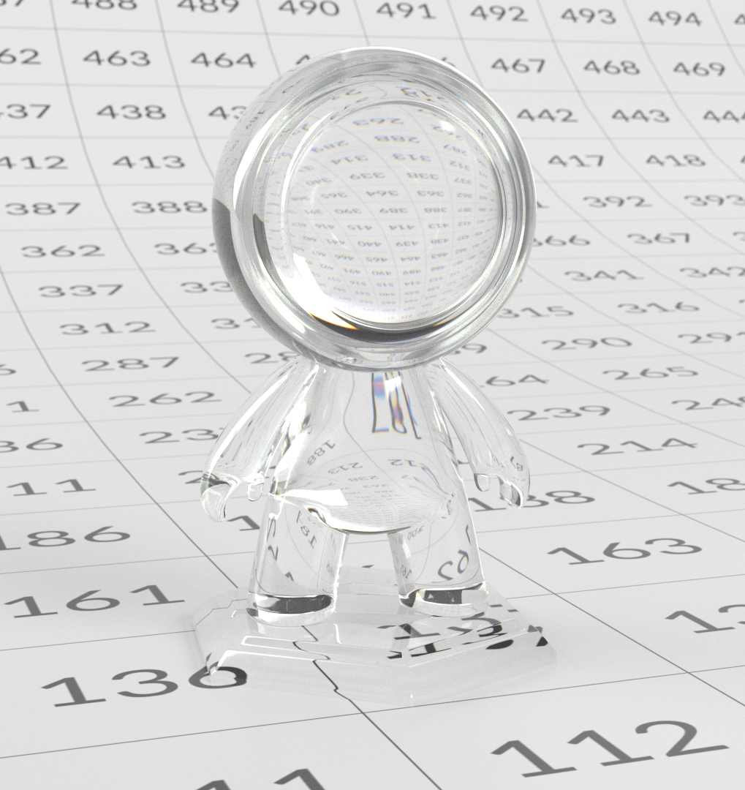

# OpenPBR

[**Laden Sie eine Offlineversion dieser Seite herunter.**](../assets/openpbrf/openpbr.pdf)

**OpenPBR** ist ein offenes, physikalisch basiertes Oberflächenmodell, das entwickelt wurde, um eine konsistente und vorhersagbare Schattierung zur Beschreibung von Materialien über verschiedene 3D-Tools, Renderer und Pipelines hinweg zu bieten. Die Lösung definiert ein umfassendes Materialmodell, das eine breite Palette realer Oberflächen abbilden kann. Gleichzeitig bleibt sie flexibel genug, um stilisierte oder künstlerisch gesteuerte Looks mit physikalisch sinnvollen Parametern zu unterstützen.

Das Modell befasst sich mit seit langem bestehenden Inkonsistenzen zwischen &quot;Standard&quot;-Shadern, die sich im Namen ähnlich verhalten, sich jedoch in Parameterdefinitionen und physikalischen Annahmen über Anwendungen hinweg unterscheiden. Basierend auf den Prinzipien des physikalisch basierten Renderings beschreibt OpenPBR Materialien im Hinblick auf reales Lichtverhalten, Betonung von Energieeinsparungen, intuitiven Parameterbereichen und stabilen Lichtverhältnissen. Anstatt eine bestimmte Benutzeroberfläche vorzuschreiben, legt OpenPBR fest, wie sich Material auf einer Basisebene verhalten, sodass Tools das Modell auf ihre eigene Weise implementieren können, während konsistente visuelle Ergebnisse beibehalten werden, wenn sich Elemente zwischen Anwendungen und Pipelines bewegen.

Dieses Dokument ist eine künstlerische Anleitung zum Verständnis und zum Arbeiten mit OpenPBR. Sie erklärt die dem Modell zugrunde liegenden Prinzipien, wie seine Bestandteile das Lichtverhalten der realen Welt beschreiben und wie diese Vorstellungen in die Entwicklung praktischer Material Kamera bewogen werden. Anstatt sich auf ein bestimmtes Programm zu konzentrieren, richtet sich der Leitfaden an 3D-Künstler, die in Bereichen wie der Entwicklung von Looks, der Texturierung und dem Rendering arbeiten und robuste, physikalisch plausible Materialien erstellen möchten, die in verschiedenen Software-Umgebungen konsistent und übertragbar bleiben.

>[!NOTE]
>
> Wenn Sie bereits mit OpenPBR arbeiten und technische Unterstützung benötigen, [haben die OpenPBR-FAQ](openpbr-faq.md) möglicherweise bereits Antworten auf Ihre Fragen.

*Die oben genannte Szene der OpenPBR-Demonstration wurde von Nikie Monteleone erstellt. Beispiel-Material- und Kanal-Renderings in diesem Dokument wurden von Celine Dameron erstellt.*

## Interoperabilität und Dateistandards

### Eine Sprache für gemeinsam genutzte Material mit OpenPBR

Eines der Hauptziele von OpenPBR ist es, die Art und Weise zu verbessern, wie Materialien zwischen Tools wechseln. Anstatt ein Shader zu sein, der mit einem einzelnen Renderer oder einer einzelnen Anwendung verknüpft ist, definiert OpenPBR ein **Modell für gemeinsam genutzte Schattierungen** - eine gängige Methode, um zu beschreiben, wie ein Material auf Licht reagiert.

Für Künstler bedeutet dies, dass ein OpenPBR-Material nicht nur zum Beispiel ein &quot;Adobe-Material&quot; oder ein &quot;Autodesk-Material&quot; ist, sondern vielmehr eine Beschreibung des Flächen- und Lautstärkeverhaltens, die grundsätzlich von mehreren Tools verstanden werden kann. Damit soll erreicht werden, dass ein Material, das in einer Anwendung erstellt wurde, auch anderswo konsistent interpretiert werden kann, solange diese Tools das OpenPBR-Modell unterstützen.

### Das Problem des Austauschs von Vermögenswerten

Die OpenPBR-Spezifikation erkennt ausdrücklich eine langjährige Herausforderung in der Fertigung an: **Materialien können nicht gut zwischen Anwendungen ausgetauscht werden**. Verschiedene Renderer verwenden häufig unterschiedliche Parameternamen, Schattierung-Annahmen und zugrunde liegende Modelle, was die Anpassung des Erscheinungsbilds erschwert und zeitaufwendig macht.

OpenPBR ist als Reaktion auf dieses Problem konzipiert. Durch die Festlegung eines einzigen, physikalisch geerdeten Materialmodells, das den gemeinsamen Produktionsbedarf deckt - Metalle, Dielektrika, geschichtete Material, Übertragung, Streuung -, bietet es ein stabiles Ziel für den Austausch. Das garantiert zwar nicht in jeder Situation perfekte optische Übereinstimmungen, senkt aber im Vergleich zu proprietären Shader-Modellen die Mehrdeutigkeit deutlich.

Für Künstler ist der praktische Vorteil, dass OpenPBR darauf abzielt, *Absicht* zu bewahren. Auch wenn eine exakte visuelle Parität nicht möglich ist, bleibt der Aufbau des Materials - was ist Metall, was ist transmissive, wie rau oder anisotropisch eine Fläche ist - klar und übertragbar.

### Beziehung zu MaterialX

OpenPBR ist eng mit **MaterialX** verbunden, einem branchenüblichen Framework zum Beschreiben von Materialien und zum renderer-unabhängigen Aussehen. Die Referenzimplementierung von OpenPBR befindet sich in MaterialX, was bedeutet, dass OpenPBR-Material mit einem etablierten Austauschformat dargestellt werden können, das bereits über viele Pipelines unterstützt wird.

Diese Beziehung ist wichtig, da die OpenPBR selbst **kein Dateiformat** ist. Stattdessen wird *definiert, was* ein Material ist, während MaterialX eine standardisierte Möglichkeit bietet, dieses Material *zu speichern und zwischen Tools auszutauschen*. In der Praxis ermöglicht dies, dass OpenPBR-Materialien in breitere Materialbeschreibungen eingebettet und über DCCs und Renderer, die MaterialX unterstützen, ausgetauscht werden.

Für Künstler geschieht dies normalerweise unter der Haube - aber es erklärt, warum OpenPBR-Materialien in modernen Pipelines zunehmend als &quot;portabel&quot; oder &quot;interoperabel&quot; bezeichnet werden.

### Was Interoperabilität bedeutet und was nicht

Es ist wichtig, realistische Erwartungen in Bezug auf Interoperabilität zu setzen. OpenPBR verspricht nicht, dass ein Material in jeder Anwendung gleich aussieht. Unterschiede bei der Beleuchtung, den Rendering-Algorithmen, dem Farbmanagement und der Funktionsunterstützung können sich weiterhin auf das endgültige Bild auswirken.

Was OpenPBR bietet, ist eine gemeinsame Grundlinie: Konsistente Parameter und Verhaltensweisen, ein gemeinsames Verständnis der Konstruktion von Materialien und ein klarerer Pfad für die Übertragung von Materialien zwischen Werkzeugen, ohne sie von Grund auf neu zu erstellen.

Für Künstler bedeutet dies weniger Überraschungen, wenn Elemente zwischen Abteilungen oder Anwendungen verschoben werden, und einen Workflow, der auf dauerhafte Material-Logik setzt und nicht auf werkzeugspezifische Tricks.

### Praktische Auswirkungen für Künstler

In der täglichen Perspektive fördert das Arbeiten mit OpenPBR Gewohnheiten, die Interoperabilität auf natürliche Weise unterstützen:

* Denken im Hinblick auf das Lichtverhalten und nicht auf anwendungsspezifische Materialtypen
* Verwendung physikalisch relevanter Parameter (Metallisierung, Rauheit, Transmission, Streuung)
* Vermeidung der Abhängigkeit von Lösungen ohne Dokumente oder Renderer

Auch wenn ein Material niemals ein einzelnes Programm verlässt, entsprechen diese Vorgehensweisen modernen Pipelinestandards - dadurch werden Assets im Zuge der Weiterentwicklung von Tools und Renderern zukunftssicherer.

## Material

### Materialien, die durch Interaktion mit Licht definiert werden

OpenPBR ist ein monolithisches Modell (ein &quot;Uber-Shader&quot;), das eine breite Palette von Materialarten repräsentieren soll; Diese Arten werden in Bezug auf die Interaktion von Licht mit ihnen beschrieben. Anstatt Materialien in Form fester Vorgaben wie z. B. &quot;OpenPBR&quot; oder &quot;Skin&quot; zu definieren, basiert jedes Glasmodell auf einem Material aus horizontaler und vertikaler Schichtung, das es den Künstlern ermöglicht, vollständig definierte und physikalisch bedeutsame Merkmale wie diffuse Reflexion, Specular-Reflexion, Transmission, Volumenstreuung und Schichtung miteinander zu vermischen. Verschiedene Kombinationen dieser Verhaltensweisen erzeugen auf natürliche Weise bekannte Material aus der realen Welt.

<table>
  <tr style="border: 0;">
    <td style="border: 0;" valign="top"></td>
    <td style="border: 0;" valign="top"></td>
    <td style="border: 0;" valign="top"></td>
  </tr>
</table>

Dieser Ansatz nutzt ein festes Modell, das im Voraus den Rahmen für das Überlagern und Mischen festlegt und so jede Anforderung des Künstlers umgeht, von Fall zu Fall ein Schattierung-Netzwerk zu schaffen, und es der OpenPBR ermöglicht, sowohl einfache als auch komplexe Material konsistent und physikalisch fundiert darzustellen.

 Klicken Sie zum Zoomen. *Abbildung angepasst von der OpenPBR Surface-Spezifikation, © Academy Software Foundation, die unter der Apache-Lizenz 2.0 verwendet wird*

### Core Material Behaviors

Obwohl die OpenPBR keine strikten Material-Typen vorschreibt, lassen sich die meisten realen Material in einige wenige große Verhaltenskategorien einteilen. Das Verständnis dieser Kategorien kann dazu beitragen, ein solides mentales Modell für das Bauen von Materialien zu etablieren.

### Dielektrische (nicht metallische) Materialien

<table>
  <tr style="border: 0;">
    <td style="border: 0;" valign="top"> <em>Ein Beispiel für ein dieletrisches Material.</em></td>
    <td style="border: 0;" valign="top">Dielektrika sind nichtmetallische Materialien wie Kunststoff, Holz, Stein, Stoff, Gummi und Hülle. Sie zeichnen sich durch folgende Merkmale aus:  <ul><li>Eine sichtbare diffuse Komponente</li><li>Meist farblose (weiße) Specular-Reflexionen</li><li>Reflexionsgrad, der hauptsächlich durch den Brechungsindex (IOR) gesteuert wird</li><li>Kein metallic Reflexionsverhalten</li></ul>  <strong>Schlüsselparameter für dielektrische Material:</strong>  <ul><li>Grundfarbe definiert die Gesamtfarbe des Materials</li><li>Specular Color beeinflusst den Farbton der Specular-Lichter (am stärksten hervorgehoben in Weidewinkeln)</li><li>Specular-Rauheit steuert, wie scharfe oder unscharfe Specular-Lichter angezeigt werden.</li><li>Specular Weight skaliert die Gesamtintensität von Specular-Lichtern </li><li>Bei dielektrischen Materialien dominiert die diffuse Reflexion das Erscheinungsbild der Oberfläche und wird durch die Grundfarbe gesteuert. Specular-Reflexionen sind bei normalem Einfall begrenzt und nehmen in Richtung der Graswinkel zu, bleiben aber ungetönt.</li></ul></td>
  </tr>
</table>

### Metallic Material

<table>
  <tr style="border: 0;">
    <td style="border: 0;" valign="top"> <em>Ein Beispiel für ein metallic Material.</em></td>
    <td style="border: 0;" valign="top">Metallic Materialien wie Stahl, Aluminium, Kupfer oder Gold verhalten sich grundlegend anders als nicht metallic (dielektrische) Materialien. Bei Metallen wird das Erscheinungsbild fast ausschließlich von der Reflexion des Speculars bestimmt: Im Gegensatz zu Dielektrika haben Metalle keinen diffusen Anteil, und das Licht Streuung nicht unter der Wasseroberfläche, sondern wird direkt reflektiert. Sie zeichnen sich durch folgende Merkmale aus:  <ul><li>Keine diffuse Komponente - Farbe entsteht vollständig durch Reflexion</li><li>Farbige Specular-Reflexionen</li><li>Oberflächendetails, insbesondere Rauheit, spielen eine wichtige Rolle im Erscheinungsbild</li></ul>  <strong>Schlüsselparameter für metallic Material:</strong>  <ul><li>Grundfarbe steuert die Farbe der Reflexionen</li><li>Die Specular-Rauheit steuert, wie scharf oder unscharf diese Reflexionen erscheinen</li><li>Specular Weight skaliert die Reflexionsintensität</li></ul></td>
  </tr>
</table>

### Basis-Metallik

&quot;Metalität (Base)&quot; definiert, ob sich ein Material als Dielektrikum oder als Metall verhält. Dabei handelt es sich nicht nur um eine optische Veränderung, sondern auch um eine Veränderung der zugrunde liegenden Lichtempfindlichkeit des Materials.

* **0** → vollständig nicht metallic (diffus + Specular)
* **1** → vollständig metallic (nur Specular)
* **0-1** → eine Mischung aus beiden Verhaltensweisen. Die Zwischenwerte werden am besten für Material-Gemische wie Dirt, Korrosion oder verschlissene Oberflächen verwendet, anstatt für &quot;teilweise metallic&quot; Materialien.

#### Praktische Richtlinien für die Metallisierung

* **0** oder **1** für die meisten Material verwenden
* Mittelwerte nur für gemischte Oberflächen verwenden
* Verlassen Sie sich auf Rauheit und Oberflächendetails, um das metallic Erscheinungsbild zu gestalten.

Für lackierte oder beschichtete Metalle, durchsichtige und transmissive-Materialien wird eine Schichtung (z. B. Beschichtung) anstelle einer Metallabsenkung verwendet.

### Transparente und transmissive-Materialien

Durchsichtige und transmissive-Materialien lassen das Licht durch sie hindurch. Gängige Beispiele sind Glas, viele Flüssigkeiten sowie klare oder getönte Kunststoffe. Sie zeichnen sich durch folgende Merkmale aus:

* Licht dringt in die Oberfläche ein und tritt aus der gegenüberliegenden Seite aus
* Thickness wirkt sich stark auf das Aussehen aus
* Refraktion gesteuert durch den Brechungsindex (IOR) und beeinflusst durch die Oberflächenrauhigkeit
* Refraktion, Absorption, Streuung und Streuung gestalten den finalen Look.

Die Übertragung beschreibt, wie Licht sich durch ein Objekt bewegt. Stärkere Bereiche erscheinen dunkler oder gesättigter, während dünnere Bereiche klarer erscheinen. Parameter wie Übertragungsfarbe, Übertragungsfarbe, Streuung-Tiefe und Dispersion arbeiten zusammen, um dieses Verhalten zu steuern.

Eine Unterscheidung zwischen den Begriffen &quot;transparent&quot; und &quot;durchscheinend&quot;: &quot;transparent&quot; ist ein realer, alltäglicher Begriff; etwas transparent ist, wenn wir es durchschauen können. &quot;Transmissiv&quot; ist ein Synonym für &quot;Transluzenz&quot;. Das gefrorene Glas zum Beispiel lässt das Licht durchdringen (und ist daher durchlässig), aber es ist nicht transparent - wir können nicht durch es hindurch sehen.

### Untergrundmaterialien

<table>
  <tr style="border: 0;">
    <td style="border: 0;" valign="top"> <em>Ein Beispiel für ein Material, das eine Untergrundstreuung verwendet.</em></td>
    <td style="border: 0;" valign="top">Untergrundmaterialien ermöglichen das Eintreten von Licht in die Oberfläche, die Streuung darunter und den erneuten Austritt von Licht in der Nähe des Eintrittspunkts. Häufig vorkommende Beispiele sind Haut, Wachs, Marmor und viele organische Materialien, wie z. B. viele Arten von Lebensmitteln. - Obst oder Gemüse oder beispielsweise Saint-Nectaire-Käse. Die charakteristischen Merkmale von Untergrundmaterialien sind:   <ul><li>Weiche, diffuse Schattierung</li><li>Farbausblendung in dünnen Bereichen</li><li>Aussehen ist von Thickness abhängig</li><li>Licht dringt nicht durch das Objekt</li></ul>   Die Volumenstreuung unterscheidet sich von der Transmission. Während die Transmission das durch ein Material hindurchtretende Licht beschreibt, das die andere Seite verlässt, beschreibt die Untergrundstreuung das in eine Oberfläche eintretende Licht, das innerhalb dieser Oberfläche streut und dann in der Nähe des Punktes austritt, an dem es eintritt, meist auf derselben Seite. Insbesondere unterstützen metallische Materialien keine Transmission oder Volumenstreuung. Eine Änderung des Transmissions- oder Untergrundwerts eines vollständig metallischen Werkstoffs (d. h. eines Werkstoffs mit einem Basismetalitätswert von 1) wirkt sich nicht auf sein Erscheinungsbild aus.</td>
  </tr>
</table>

## Mischen zwischen Materialverhalten

Echte Materialien sind selten absolut rein. Viele Oberflächen lassen sich am besten als Verhaltensmischungen beschreiben und gehören nicht einer einzigen Kategorie an. Wenn z. B. eine Fläche Anzeichen von Dirt, Abnutzung oder Rost aufweist, reagieren unterschiedliche Teile der Fläche auf unterschiedliche Weise auf das Licht. OpenPBR unterstützt dies, indem es eine fließende Überblendung von einem Teil einer Oberfläche zu einem anderen ermöglicht.

### Metalismus als Überblendung

<table>
  <tr style="border: 0;">
    <td style="border: 0;" valign="top"> <em>In diesem Material hat das Eisen eine Metallität von 1, während der Rost eine Metallität von 0 hat. Es kann Zwischenwerte für die Metalität geben, bei denen der Rost zu Eisen übergeht.</em></td>
    <td style="border: 0;" valign="top">Während die Metallität in der Regel entweder auf 0 oder 1 festgelegt ist (also entweder völlig nicht metallic oder völlig metallic), sind Zwischenwerte sinnvoll. Diese Werte stellen Flächen dar, auf denen metallic und nicht metallic Materialien in kleinem Maßstab miteinander vermischt werden, z. B. Malen, das metallische Partikeln oder Flocken enthält. Wie bereits erwähnt, werden OpenPBR-Material auch aus Ebenen erstellt, die unterschiedliche physische Schnittstellen darstellen. Es ist durchaus möglich, dass die Basisschicht eines Materials (die so genannte Kernschicht) metallic ist, aber dass sie darüber eine nicht metallic Coatschicht aufweist - die Coatschicht ist nicht nur eine zusätzliche Specular-Kontrolle -, sie stellt eine separate physikalische Fläche dar, durch die das Licht hindurchtreten muss. Dies wäre beispielsweise bei einigen Typen von Malen der Fall: metallic Flocken würden in der Basisschicht des Materials dargestellt, während die Coat-Schicht einen Klarlack darstellen würde.</td>
  </tr>
</table>

### Ebenen zu komplexem Verhalten kombinieren

Komplexe Materialien, wie z. B. die Mattscheibe oder die in diesem Abschnitt erwähnte Car-Malen, entstehen durch die kontrollierte Kombination mehrerer Verhaltensweisen. Beispiel:

* **Gefrierglas**: Übertragung kombiniert mit hoher Rauheit und Streuung
* **Metall gemalt**: eine dielektrische Fläche auf einer metallic Unterlage, oft mit einer durchsichtigen Beschichtung. Anstatt in Vorgaben zu denken, ist es effektiver, zu berücksichtigen, welche physikalischen Verhaltensweisen vorhanden sind und wie sie interagieren. OpenPBR-Materialien werden durch physikalisch relevante Komponenten definiert, die beschreiben, wie Licht mit Oberflächen interagiert. Material-Typen entstehen auf natürliche Weise aus Kombinationen von Verhaltensweisen, anstatt explizit ausgewählt zu werden. Durch Konzentration auf Lichtinteraktion, Mischmodi und Ebenen lassen sich zahlreiche realistische Materialien erstellen, ohne die räumliche Plausibilität zu beeinträchtigen.

## Arbeiten mit OpenPBR

### Die konzeptuelle Architektur eines OpenPBR-Materials

OpenPBR ist als einheitliches Oberflächenmodell konzipiert, das eine breite Palette von realen Materialien Schattierung. Anstatt zwischen verschiedenen Shadern für verschiedene Material zu wechseln, kombiniert OpenPBR mehrere Oberflächeneigenschaften zu einer Schichtenarchitektur.

Ein OpenPBR-Material sollte drei Hauptelemente haben:

* **Ein grundlegendes Framework**: OpenPBR ist der Ansicht, dass ein Material aus physikalischen Bausteinen besteht, die miteinander vermischt (waagerechte Vermischung) oder übereinander gestapelt (senkrechte Verschichtung) werden können. Diese Bereiche können unterschiedlich auf Licht reagieren. Wenn zwei solcher Blöcke überblendet werden, entsteht eine Überblendung der Reflexion der beiden. Bei einer Überlagerung kann der unterste Block jedoch nur so viel Licht empfangen und reflektieren, wie der oberste Block durchlässt. Bei dieser Einrichtung können Künstler das Material als eine Mischung aus einfacheren Komponenten betrachten. Die Definition dieser Komponenten und ihre Position ist das zweite Schlüsselelement:
* **Eine Reihe von Ebenen, die zum freigegebenen Framework beitragen**: Jedes Material verfügt über eine Basisebene, die Eigenschaften wie die Hauptfarbe des Materials oder die Farbe des Materials festlegt. Materials können auch zusätzliche Ebenen enthalten - Dünnschicht, Überzug und Fuzz -, mit denen sich Effekte wie Lack oder Dust reproduzieren lassen.
* **Ein Satz von Künstlersteuerelementen**: eine Benutzeroberfläche, die es einem Künstler ermöglicht, die Regeln des Reflexionsrahmens zu steuern - und somit das Erscheinungsbild des OpenPBR insgesamt. Abhängig davon, wie die jeweilige Software diese Steuerelemente auf der Benutzeroberfläche darstellen kann, handelt es sich im Wesentlichen um eine Reihe von Knöpfen oder Schiebereglern, mit denen ein Künstler steuern kann, z. B. wie stark die Reflexionen sein sollten oder welche Farbtöne in bestimmten Betrachtungswinkeln angezeigt werden sollten. Einige Steuerungen gelten für den Gesamtrahmen (und gelten daher für alle Ebenen im Material). Einige Steuerelemente werden nur für bestimmte Ebenen angewendet.

### Material-Ebenen innerhalb des Framework

 Klicken Sie zum Zoomen. *Abbildung angepasst von der OpenPBR Surface-Spezifikation, © Academy Software Foundation, die unter der Apache-Lizenz 2.0 verwendet wird*

Jede Schicht trägt einen bestimmten physikalischen Effekt bei, und das Materialmodell verwaltet, wie diese Schichten auf physikalisch plausible Weise interagieren. Diese mehrschichtige Struktur ist in allen OpenPBR-Implementierungen konsistent. Einzelne Anwendungen können weiterhin eine Benutzeroberfläche bereitstellen, mit der diese Ebenen nach Belieben gesteuert werden.

>[!NOTE]
>
> Es gibt zwei &quot;Ebenen&quot;, die im obigen Diagramm nicht angezeigt werden:
>
> * **Specular**: Steuert, wie glänzend oder reflektierend eine Oberfläche ist, ob die Unterlage metallic ist oder nicht. Specular existiert im Ebenenstapel, ist aber selbst keine echte Ebene. Es ist eine Eigenschaft der Grund- und Deckschichten, die im Ebenenstapel nicht vorkommen.
> * **Geometrie**: Während andere OpenPBR-Ebenen bestimmen, woraus das Material besteht, definiert die Geometry-Ebene die Form und das Vorhandensein, auf das das Material angewendet wird, einschließlich Deckkraft, Normalen, Tangenten und dünnwandigem Verhalten.
>
> Wir werden Geometrie und Specular weiterhin als &quot;Ebenen&quot; bezeichnen, um die Einfachheit zu verbessern.

Die Ebenen, die eine OpenPBR-Oberfläche bilden, von der Tiefe bis zur äußersten Ebene, sind:

* **Die Basisebene**: Am unteren Rand eines OpenPBR-Materials definiert die Basisebene die grundsätzliche Interaktion zwischen Licht und Material. Die Parameter dieser Basisschicht bestimmen die Hauptfarbe des Materials, ob es rau oder glatt ist und ob es (in Bezug auf seine Wechselwirkung mit dem Licht) metallic oder nicht metallic ist (auch dielektrisch bezeichnet).

>[!NOTE]
>
> Für die meisten Material ist die Basisebene absolut notwendig. Die darüber liegenden Schichten (Dünnschicht, Mantel und Fuzz) können je nach Art des in 3D reproduzierten Materials vorhanden sein oder auch nicht.

* **Dünnfilm**: Gegebenenfalls wird eine Dünnfilmschicht über der Basisschicht angeordnet. Es reproduziert das optische Erscheinungsbild sehr dünner Oberflächenschichten und erzeugt schillernde Farben, wie sie in Seifenblasen, verbranntem Metall oder Ölfilmen zu sehen sind.

* **Mantel**: Eine Coat-Schicht, sofern vorhanden, gibt eine transparente, reflektierende Schicht wieder, die über jeder anderen Schicht außer Fuzz positioniert ist. So lassen sich realistische Effekte wie Lackeffekte, nasse Oberflächen oder bestimmte Arten des Malen simulieren.

* **Fuzz**: Falls vorhanden, wird die Reflexion aus Mikrofasern durch eine Fuzz-Schicht wiedergegeben. Es kann verwendet werden, um das Aussehen eines Fuzzy-Gewebes, zum Beispiel, oder einer Schicht aus Dust zu reproduzieren.

Die Art und Weise, wie jede dieser Schichten mit Licht interagiert, wird durch einen Satz von Parametern bestimmt.

### Material

Die Grundmetalität wiederum bestimmt die Merkmale, die auf die nächste Ebene des Materials angewendet werden - ein vollständig nicht metallic Material besitzt andere Eigenschaften als ein metallic Material.

#### Nicht metallic Materialien (Basismetall = 0)

Ein vollständig nicht metallic Material (d. h. ein Material mit einem Basismetalitätswert von 0) wird in drei Grundtypen unterteilt: **diffuse**, **subsurface** oder **transluzente**. Beachten Sie, dass Materialien nicht unbedingt nur in einen der oben genannten Basistypen fallen. Komplexere Materialien, die eine Mischung aus diesen grundlegenden Material-Typen sind, sind möglich.

**Diffuse Materialien** sind in der Regel deckende Materialien wie Holz oder Stein.

**Unterflur-Materialien** Streuung intern beleuchtet; z. B. unter dieses Material fallen.

**Durchscheinende Basismaterial** lassen Licht durch sie hindurch; Dazu gehören Materialien wie Glas, Kristall oder bestimmte Flüssigkeiten. Zu berücksichtigende Schlüsselparameter sind die globalen Parameter für den Specular, die Parameter für die Basisebene und die spezifischen Parameter für die Übertragung, die unten aufgeführt sind. Der Unterschied zwischen Volumenstreuung (SSS) und Transmission besteht im Wesentlichen darin, dass SSS es einem nicht erlaubt, durch das Material zu sehen - ein Lichtstrahl wird innerhalb eines Materials gestreut und kommt dann auf der gleichen Seite wieder heraus. Die Übertragung dagegen regelt Materialien, die zumindest teilweise durchsichtig sind - ein Lichtstrahl durchdringt das Material.

#### Metallic Materialien (Metallität > 0)

Umgekehrt erfasst Base Metalness, wenn es aktiviert ist (d. h., wenn der Wert größer als 0 ist), einige spezifische Verhaltenseigenschaften:

* Der Wert für &quot;Specular-Farbe&quot; des Materials steuert den Farbton des Materials in der Nähe von Weidewinkeln (wenn das Licht in einem Winkel auf eine Fläche trifft, der nahe an der Parallelität liegt).
* Der Wert für die Grundfarbe des Materials steuert die Reflexion bei normalem Einfall (d. h., wenn das Licht von der Fläche aus in 90 Grad reflektiert wird).
* Der Wert &quot;Specular Weight&quot; des Materials skaliert die allgemeine Stärke der Reflexionen und beeinflusst sowohl den Normal- als auch den Weidewinkel.

In Kombination mit den folgenden Kanälen können metallic Material verschiedene Effekte erzeugen.

**Emission**

Die Emission ermöglicht es einer Oberfläche, als Lichtquelle zu fungieren, indem Licht direkt emittiert wird. Die Emission ist zwar kein reflektierendes Phänomen, wird aber in das OpenPBR-Materialmodell aufgenommen, sodass Emissionsmaterialien einheitlich neben reflektierenden und durchlässigen Eigenschaften definiert werden können.

**Dünnfilm**

<table>
  <tr style="border: 0;">
    <td style="border: 0;" valign="top"></td>
    <td style="border: 0;" valign="top">Ein Dünnschichteffekt, sofern vorhanden, reproduziert das optische Erscheinungsbild sehr dünner Oberflächenschichten und erzeugt schillernde Farben, wie sie beispielsweise in Seifenblasen oder Ölfilmen zu sehen sind.</td>
  </tr>
</table>

**Mantel**

Eine Coat-Schicht, sofern vorhanden, gibt eine transparente, reflektierende Schicht wieder, die über jeder anderen Schicht außer Fuzz positioniert ist. So lassen sich realistische Effekte wie Lackeffekte oder bestimmte Malen simulieren. Eine Coat-Schicht wird durch einen Bereich zwischen 0 und 1 definiert. Wenn Sie diesen Wert auf 0 setzen, wird die Ebene &quot;Coat&quot; vollständig deaktiviert.

**Fuzz**

Du kannst eine Fuzz-Ebene hinzufügen, um das Aussehen von gewebten Oberflächen wie Samt oder Satin zu simulieren. Oder du erzeugst den Effekt einer Dust auf einer Oberfläche.

### Workflow-Konzepte für Materials

#### Denken in Lichtverhalten, nicht in Materialbeschriftungen

Bei OpenPBR geht es eher um das Verhalten von Licht als um feste Materialkategorien. Anstatt einen Shader auszuwählen, der &quot;Glas&quot;, &quot;Haut&quot; oder &quot;Metall&quot; repräsentiert, erstellen Künstler Materialien, indem sie beschreiben, wie Licht von einer Fläche reflektiert, durch diese hindurchtritt, in ihr Streuungen bildet oder von ihr emittiert wird. Dieser Ansatz fördert einen Wandel der Mentalität: Material sind keine vordefinierten Typen, sondern Kombinationen aus physikalischem Verhalten. Ein einziges Material aus der realen Welt kann mehrere dieser Verhaltensweisen gleichzeitig enthalten, und OpenPBR macht diese Beiträge explizit, anstatt sie hinter Vorgaben oder deckenden Schattierung-Modellen zu verstecken.

#### Getrennte Anliegen: Materialien sind nicht lichtabhängig

Ein Grundprinzip physikalisch basierter Workflows ist die Trennung von Material-Beschreibung und Beleuchtung. Materialien werden erstellt, um die internen Flächen- und Volumeneigenschaften zu beschreiben, während die Beleuchtung die Umgebung definiert, in der diese Eigenschaften eingeblendet werden. Durch diese Trennung wird die gegenseitige Abhängigkeit verringert und die Verwaltung komplexer Szenen vereinfacht. Ein gut gestaltetes OpenPBR-Material sollte auch bei unterschiedlichen Lichtverhältnissen glaubwürdig bleiben, ohne dass es Szene-spezifischer Anpassungen bedarf. Auch in kleinerem Maßstab setzt OpenPBR diese Philosophie fort, indem es die Parameter so unabhängig wie möglich hält. So können Künstler einen Aspekt eines Materials anpassen, ohne andere unbeabsichtigt zu destabilisieren.

#### Inkrementelles Erstellen von Materialien

OpenPBR fördert einen schrittweisen Ansatz zur Schaffung von Materialien. Die meisten Workflows beginnen damit, die Oberflächenreaktion - also die Art und Weise, wie das Licht vom Objekt reflektiert wird - festzulegen, bevor Volumeneffekte wie Transmission oder Volumenstreuung eingeführt werden. Sekundäre Verhaltensweisen, wie z. B. Fuzz, Emission oder Dünnschichtinterferenz, werden in der Regel später aufgeschichtet, um den Realismus zu verfeinern oder bestimmte visuelle Hinweise zu erhalten. Dieser mehrschichtige Ansatz hilft Künstlern, Probleme einfacher zu diagnostizieren und zu vermeiden, dass Material zu früh im Prozess überkompiliert werden. Durch die Erstellung von primärem Verhalten auf sekundäres Verhalten bleiben Material leichter zu verstehen, zu debuggen und wiederzuverwenden.

#### Vorgaben und Beispiele als Lernwerkzeuge

OpenPBR enthält Vorgaben für gängige Material, die jedoch am besten als Referenzbeispiele und nicht als endgültige Lösungen verstanden werden. Wenn du überprüfst, wie die Presets die Parameter für den Abgleich von Rauheit, Metallität oder Tiefe der Übertragung ausgleichen, kannst du besser verstehen, wie die einzelnen visuellen Ergebnisse umgesetzt werden. Statt auf umfassende Vorgaben zu setzen, ermutigen OpenPBR-Workflows Künstler, reale Material zu beobachten, die zugrunde liegenden Lichtverhalten beim Spielen zu identifizieren und diese mithilfe physisch sinnvoller Steuerelemente nachzuahmen.

## OpenPBR-Kanäle und -Parameter

### Glanz

{width="250"}

*Ein dielektrisches (nicht metallic) graues Material mit einer gelben Specular-Farbe.*

+++Specular-Parameter

**Specular-Gewicht**

Während die Specular-Farbe den Farbton jeder Reflexion unter Graswinkeln bestimmt, bestimmt die Specular-Stärke die Intensität dieser Reflexionen zwischen einem Bereich von 0 und 1. Bei einem Wert von 0 gibt es überhaupt keine Reflexion bei Weidewinkeln. Bei höheren Werten wird die Intensität solcher Reflexionen stärker ausgeprägt. Beachten Sie, dass in der &quot;realen Welt&quot; jedes Material bis zu einem gewissen Grad reflektierend ist, und wenn es in 3D nachgebildet wird, hätte es einen Specular-Gewichtswert von mehr als 0. Beachten Sie auch, dass das Gewicht des Speculars in keiner Weise als &quot;primärer&quot; Wert für die Parametrierung der Reflexion eines Materials betrachtet werden sollte; Die Rauheit des Speculars (siehe unten) ist immer ein wichtiger Gesichtspunkt bei der Bestimmung des Reflexionsgrads eines Materials.

<table>
  <tr style="border: 0;">
    <td style="border: 0;" valign="top"> <em>Specular-Gewicht = 0,0</em></td>
    <td style="border: 0;" valign="top"> <em>Specular = 0,5</em></td>
    <td style="border: 0;" valign="top"> <em>Specular = 1,0</em></td>
  </tr>
</table>

**Specular-Farbe**

Dadurch wird jeder Farbton für Reflexionen bestimmt, wenn das Licht in einem Graswinkel reflektiert (einem Winkel, der nahezu parallel zur Oberfläche eines Materials ist). Bei metallic Materialien (siehe Metalness, unten) kann ein Farbton angewendet werden. für nicht metallic Materialien Specular Color sollte normalerweise weiß sein. Die folgenden Abbildungen zeigen verschiedene Specular-Farben auf metallic und nicht metallic Materialien.

<table>
  <tr style="border: 0;">
    <td style="border: 0;" valign="top"> </td>
    <td style="border: 0;" valign="top"> </td>
    <td style="border: 0;" valign="top"> </td>
  </tr>
  <tr style="border: 0;">
    <td style="border: 0;" valign="top"> <em>Grüner Specular</em></td>
    <td style="border: 0;" valign="top"> <em>Violett-Specular</em></td>
    <td style="border: 0;" valign="top"> <em>Gelber Specular</em></td>
  </tr>
</table>

**Specular-Rauheit**

Wie der Parameter &quot;Rauheit&quot; in einem PBR-Material stellt die Specular-Rauheit in einem OpenPBR-Material eine mikroskopische Oberflächenvariation dar: selbst Flächen, die mit bloßem Auge glatt erscheinen, weisen winzige Unvollkommenheiten auf, die von der Streuung reflektiert werden. Dieser Wert gibt diesen Effekt wieder und steuert, wie glatt oder rau eine Oberfläche in ihren Reflexionen erscheint. Hierfür wird definiert, wie stark oder breit das Licht reflektiert wird. Materialien mit niedriger Rauheit erzeugen scharfe, spiegelartige Reflexionen. Umgekehrt erzeugen Materials mit hoher Rauheit weiche, unscharfe Reflexionen.

<table>
  <tr style="border: 0;">
    <td style="border: 0;" valign="top"> <em>Specular Rauheit = 0,1</em></td>
    <td style="border: 0;" valign="top"> <em>Specular Rauheit = 0,5</em></td>
    <td style="border: 0;" valign="top"> <em>Specular Rauheit = 0,8</em></td>
  </tr>
</table>

Beachten Sie, dass dies keinen Einfluss auf die Gesamtmenge des reflektierten Lichts hat - es ist lediglich ein Maß dafür, ob dieses Licht sehr fokussiert oder diffus reflektiert wird.

**IOR (Brechungsindex)**

Der IOR beschreibt, wie stark ein Material mit dem Material interagiert und steuert, wie sich die Lichtstrahlen beim Eintritt in das Bild biegen (brechen) und wie reflektierend es wirkt, insbesondere bei flachen (weidenden) Blickwinkeln. Weniger reflektierende Oberflächen, wie Wasser oder einige Kunststoffe, haben einen niedrigen IOR. Mehr reflektierende Oberflächen - z. B. Glas oder einige Edelsteine - haben einen höheren IOR und einen stärkeren Brechungseffekt. Der IOR eines Materials ist ein physischer Wert, und als solcher ist es eine objektive Zahl, anstatt eine Frage der künstlerischen Interpretation. Wenn Sie ein bestimmtes Material erstellen, müssen Sie nur die IOR des Materials nachschlagen und sicherstellen, dass diese richtig eingestellt ist, um sicherzustellen, dass das Material mit Licht korrekt reagiert. Eine Reihe von Quellen sind online verfügbar, in denen die IORs verschiedener Material aufgelistet sind. Der IOR für Granit beträgt beispielsweise 1,43. Wenn Sie ein Granit-Material erstellen würden, würden Sie diesen Wert als IOR eingeben, um sicherzustellen, dass das Licht Ihr Material auf realistische Weise reflektiert. Beachten Sie, dass IOR keine Auswirkungen auf metallic Material hat (siehe Metalness, unten). Eine Änderung des IOR-Werts eines metallic Materials wirkt sich nicht auf dessen Darstellung aus.

<table>
  <tr style="border: 0;">
    <td style="border: 0;" valign="top"> <em>IOR = 1,1</em></td>
    <td style="border: 0;" valign="top"> <em>IOR = 1,5</em></td>
    <td style="border: 0;" valign="top"> <em>IOR = 2,0</em></td>
  </tr>
</table>

**Anisotropie**

Wenn die mikroskopischen Oberflächenvariationen etwa gleichsinnig ausgerichtet sind, wie Nuten, neigt die Reflexion des Materials dazu, von der Blickrichtung abhängig zu sein und senkrecht zu den Nuten dehnen. Je mehr diese Nuten ausgerichtet sind, desto ausgeprägter ist der Effekt. Mit dem Wert &quot;Anisotropie&quot; des Materials wird festgelegt, ob die Reflexionen einer Oberfläche in allen Richtungen gleich aussehen oder ob sie in einer bestimmten Weise gedehnt werden. Dies könnte die Wirkung von Materialien wie z. B. gebürstetem Metall wiedergeben, bei denen die Reflexionen entlang des &quot;Pinseleffekts&quot; viel länger sind. Anisotrope Reflexionen können auch subtiler auftreten, wenn eine polierte Fläche mit einem Fingerabdruck verschmiert wird oder wenn eine verformbare Fläche, wie z.B. trockene Haut, gedehnt wird.

<table>
  <tr style="border: 0;">
    <td style="border: 0;" valign="top"> <em>Anisotropie = 0,0</em></td>
    <td style="border: 0;" valign="top"> <em>Anisotropie = 0,5</em></td>
    <td style="border: 0;" valign="top"> <em>Anisotropie = 1,0</em></td>
  </tr>
</table>

**Anisotropie Tangente**

Wenn ein gewisses Maß an Anisotropie vorhanden ist (d. h. der Wert der Anisotropie des Materials ist größer als 0), gibt die Tangente der Anisotropie die dominierende Richtung der Nuten an. Die Reflexion dehne senkrecht zu dieser Richtung.

<table>
  <tr style="border: 0;">
    <td style="border: 0;" valign="top"></td>
    <td style="border: 0;" valign="top"></td>
    <td style="border: 0;" valign="top"></td>
  </tr>
</table>

*Verschiedene Ausrichtungen der Tangente der Anisotropie.*

+++

### Geometrie

OpenPBR enthält auch Parameter, die die Interaktion des Materials mit der Geometrie beeinflussen, z. B. Deckkraft und dünnwandiges Verhalten. Diese Kontrollen legen fest, ob eine Fläche als mit einer physischen Thickness oder als dünne Schale behandelt werden soll, was besonders für Materialien wie Papier, Blätter, Fenster oder Gewebe wichtig ist

+++Geometrie-Parameter

* **dünnwandig**: Bei aktivierter dünnwandiger Ausführung wird das Material als mikroskopisch dünn angesehen. Es wird angenommen, dass Licht ohne sichtbare Brechung durch das Material hindurchtritt.
* **Deckkraft**: Bestimmt, ob ein Material teilweise oder vollständig durchsichtig ist. Beachten Sie, dass der Parameter &quot;Transmission&quot; zwar die Transparenz eines Materials definiert, der Parameter &quot;Deckkraft&quot; jedoch verwendet werden kann, um das Netting zu definieren - also im Wesentlichen die Material-Informationen zu &quot;entfernen&quot;, um Löcher zu erzeugen.

+++

### Die Basisebene

Die Basisebene am unteren Rand des OpenPBR-Materials repräsentiert die grundsätzliche Wechselwirkung zwischen dem Licht und dem Oberflächenmodell. Die Basisebene wird durch vier Eigenschaften definiert: Rauheit von Basisgewicht, Grundfarbe, Metallität und Diffuse.

<table>
  <tr style="border: 0;">
    <th style="border: 0;"></th>
    <td style="border: 0;" valign="top"></td>
  </tr>
</table>

*Gelbe dielektrische und metallic Materialien nebeneinander.*

+++Eigenschaften der Basisschicht

* **Basisgewicht**: Definiert im Wesentlichen die Intensität der Grundfarbe (siehe unten) auf einer Skala von 0 bis 1, wobei ein Wert von 0 zu einem primär schwarzen Material (keine Farbe) und einem Wert von 1 (einer Kombination aus dem größtmöglichen Anteil an Rot-, Grün- und Blaulicht) führt.

<table>
  <tr style="border: 0;">
    <td style="border: 0;" valign="top"> <em>Basisgewicht = 0,0</em></td>
    <td style="border: 0;" valign="top"> <em>Basisgewicht = 0,5</em></td>
    <td style="border: 0;" valign="top"> <em>Basisgewicht = 1,0</em></td>
  </tr>
</table>

* **Grundfarbe**: Dies bestimmt die &quot;Hauptfarbe&quot; eines Materials, indem die Albedo - d. h. die Menge des reflektierten Rot-, Grün- und Blaulichts - sowohl der metallischen als auch der diffusen (bei nicht-metallischen) Untergründe festgelegt wird. Wie bereits erwähnt, bestimmt die Grundfarbe zwar, welche Farben gespiegelt werden, aber die Grundstärke bestimmt die Intensität dieser Spiegelung.

<table>
  <tr style="border: 0;">
    <td style="border: 0;" valign="top"></td>
    <td style="border: 0;" valign="top"></td>
    <td style="border: 0;" valign="top"></td>
  </tr>
</table>

* **Metalität**: Legt fest, ob sich ein Material auf einer Skala von 0 bis 1 wie nichtmetallisch (dielektrisch) oder metallisch verhält (0 = dielektrisch, 1 = vollständig metallisch und undurchsichtig).

<table>
  <tr style="border: 0;">
    <td style="border: 0;" valign="top"> <em>Metalität = 0,5</em></td>
    <td style="border: 0;" valign="top"> <em>Metalität = 1,0</em></td>
    <td style="border: 0;" valign="top"> <em>Metalität = 1,0 mit gelber Grundfarbe</em></td>
  </tr>
</table>

* **Diffuse Raueit**: Definiert die Mikro-Oberflächenrauhigkeit eines Materials, von 0 (mit einer sehr glatten, gleichmäßigen Reflexion) bis 1 (mit einer sehr rauen, diffusen Reflexion), geeignet für Materialien wie Stein oder Baumrinde.

<table>
  <tr style="border: 0;">
    <td style="border: 0;" valign="top"> <em>Diffuse Raueit = 0,0</em></td>
    <td style="border: 0;" valign="top"> <em>Diffuse Raueit = 1,0</em></td>
    <td style="border: 0;" valign="top"> <em>0,0 vs. 1,0 nebeneinander</em></td>
  </tr>
</table>

+++

### Volumen

{width="250"}

*Ein Material, das den unterirdischen Kanal verwendet. Beachten Sie die Lichtdurchlässigkeit in den Händen und anderen dünnen Bereichen des Gitters.*

+++Parameter des Untergrunds

* **Flächengewicht**: Damit wird festgelegt, wie viel Volumenstreuung verwendet wird - im Wesentlichen, wie viel Licht in das Material eintritt.

<table>
  <tr style="border: 0;">
    <td style="border: 0;" valign="top"> <em>Gewicht = 0</em></td>
    <td style="border: 0;" valign="top"> <em>Gewicht = 0,5</em></td>
    <td style="border: 0;" valign="top"> <em>Gewicht = 1,0</em></td>
  </tr>
</table>

* **Untergrundfarbe**: Definiert die Gesamtfarbe des Lichts, das unter der Oberfläche eines Materials wieder austritt. Hellere Farben führen in der Regel zu einer helleren, sichtbareren Streuung. Ein schwarzer Wert führt hier zu keinem unterirdischen Streueffekt.

<table>
  <tr>
    <td></td>
    <td></td>
    <td></td>
  </tr>
</table>

* **Unteroberflächenradius**: Legt fest, wie weit Licht innerhalb eines Materials wandern kann, bevor es gestreut oder absorbiert wird. Bei einem niedrigen Wert bewegt sich das Licht nur eine kurze Strecke. Materialien werden dadurch ein dichtes Erscheinungsbild haben. Bei einem hohen Radius wandert Licht weiter; Materialien haben einen weichen, wachsartigen, durchscheinenden Look.

<table>
  <tr>
    <td> <em>Radius = 1</em></td>
    <td> <em>Radius = 10</em></td>
    <td> <em>Radius = 20</em></td>
  </tr>
</table>

* **Skalierung des Untergrund-Radius**: Steuert die Farbkanalabhängigkeit des mittleren freien Pfades. Mit anderen Worten, wie weit Licht unabhängig pro RGB-Kanal durch das Material wandert, bevor es absorbiert oder gestreut wird. Dies führt zu der charakteristischen Farbvariation, die bei Materialien unter der Oberfläche zu beobachten ist: in den schmaleren Bereichen des Meshs, in denen das Licht eine geringere Entfernung zurücklegt, wird die Farbe zu dem Kanal verschoben, der den längsten Radius hat.\\

Der Standardwert (1, 0,5, 0,25) bedeutet, dass sich das rote Licht am tiefsten bewegt, gefolgt von Grün und dann Blau, was dem Verhalten vieler realer unterirdischer Material, einschließlich Skin, sehr ähnlich ist.

<table>
  <tr>
    <td> <em>Radius-Skalierung = Standard</em></td>
    <td> <em>Radius-Skalierung = Grau</em></td>
    <td> <em>Radiusskala = Weiß</em></td>
    <td> <em>Radius-Skala = Gelb</em></td>
    <td> <em>Radiusskala = Braun</em></td>
  </tr>
</table>

* **Anisotropie des Untergrunds**: Legt die Richtung fest, in die das Licht die Streuung innerhalb eines unterirdischen Materials lenkt. Bei einem Wert von 0 ist die Streuung des Lichts gleichmäßig in alle Richtungen. Bei einem positiven Wert tendiert das Licht dazu, in dieselbe Streuung wie der ursprüngliche Lichtstrahl nach vorn zu gehen. Dies führt in der Regel zu Materialien mit einem klareren, durchsichtigeren Erscheinungsbild. Bei einem negativen Wert neigt das Licht dazu, rückwärts in Streuung zur Lichtquelle des Lichtstrahls zu gehen; Dadurch erhalten Materials in der Regel ein deckenderes, dichteres Erscheinungsbild.

<table>
  <tr>
    <td> <em>Anisotropie = -1</em></td>
    <td> <em>ANISOTROPIE = 0</em></td>
    <td> <em>ANISOTROPIE = 1</em></td>
  </tr>
</table>

+++

### Übertragung

Die Übertragung steuert die Lichtmenge, die durch ein Material hindurchtreten kann. Im Gegensatz zur Option &quot;Unterfläche&quot; steuert die Transmission, wie viel Licht das Objekt vollständig durchdringt, wobei die Option &quot;Unterfläche&quot; steuert, wie viel Licht vom Inneren des Objekts zurück zur Oberfläche reflektiert wird.

{width="250"}

*Ein Beispiel für ein Material mit hohem transmissive und einer orangefarbenen Übertragungsfarbe.*

+++Übertragungsparameter

* **Gewicht**: Steuert die Lichtmenge, die durch die Fläche des Materials hindurchtreten kann. Häufig verwendet für durchsichtige Materialien wie Flüssigkeiten oder Glas.

<table>
  <tr style="border: 0;">
    <td style="border: 0;" valign="top"> <em>Gewicht = 0,0</em></td>
    <td style="border: 0;" valign="top"> <em>Gewicht = 0,5</em></td>
    <td style="border: 0;" valign="top"> <em>Gewicht = 1,0</em></td>
  </tr>
</table>

* **Farbe**: Bestimmt die Farbe des Lichts, das durch ein Material fällt.

<table>
  <tr style="border: 0;">
    <td style="border: 0;" valign="top"></td>
    <td style="border: 0;" valign="top"></td>
    <td style="border: 0;" valign="top"></td>
  </tr>
</table>

* **Tiefe**: Definiert in Zentimetern, wie weit ein Lichtstrahl durch ein Material gehen muss, bevor die Transmissionsfarbe die volle Sättigung erreicht - im Wesentlichen, wie schnell das Licht die Farbe aufnimmt, wenn es durch ein transparentes (oder teilweise transparentes) Material hindurchtritt. Bei Materialien mit geringer Tiefe der Übertragung nimmt das Licht sehr schnell Farben auf, was bedeutet, dass selbst sehr dünne Teile des Materials stark farbig aussehen. Umgekehrt werden bei einer hohen Tiefe dickere Abschnitte sehr dunkel oder fast deckend aussehen, und das Material wird ein &quot;dichtes&quot; Aussehen haben, wie gefärbtes Harz oder dickes Fluid.

<table>
  <tr style="border: 0;">
    <td style="border: 0;" valign="top"> <em>TIEFE = 0</em></td>
    <td style="border: 0;" valign="top"> <em>TIEFE = 1</em></td>
    <td style="border: 0;" valign="top"> <em>Tiefe = 10</em></td>
  </tr>
</table>

* **Farbe der Streuung**: Diese Einstellung legt die Farbe und Stärke des Lichts fest, das innerhalb eines transparenten oder teilweise transparenten Materials gestreut wird. Sie definiert im Wesentlichen die innere &quot;Bewölkung&quot; eines Materials und bestimmt, wie sich das Licht im Material ausbreitet und erweicht. Streuung Color eignet sich für die Wiedergabe von Materialien, bei denen das Licht nicht sauber oder geradlinig verläuft, z. B. bei bestimmten Kunststoffen, Milch oder bewölktem Apfelsaft, oder auch bei großen Wasserkörpern (wodurch beispielsweise der Blauton des Ozeans entsteht).

<table>
  <tr style="border: 0;">
    <td style="border: 0;" valign="top"> <em>Dunkelgraue Streuung</em></td>
    <td style="border: 0;" valign="top"> <em>Mittelgraue Streuung</em></td>
    <td style="border: 0;" valign="top"> <em>Weiße Streuung</em></td>
  </tr>
</table>

* **Streuung Anisotropie**: Dadurch wird festgelegt, in welche Richtung das Licht in einem Material zur Streuung neigt. Bei einem Wert von 0 ist die Streuung des Lichts gleichmäßig in alle Richtungen. Bei einem positiven Wert tendiert das Licht dazu, in dieselbe Streuung wie der ursprüngliche Lichtstrahl nach vorn zu gehen. Dies führt in der Regel dazu, dass die Materialien klarer und glasartiger aussehen. Bei einem negativen Wert neigt das Licht dazu, rückwärts in Streuung zur Lichtquelle des Lichtstrahls zu gehen; Dadurch erhalten Materialien in der Regel ein frostiges oder kreidiges Aussehen.

<table>
  <tr style="border: 0;">
    <td style="border: 0;" valign="top"> <em>Anisotropie = -1</em></td>
    <td style="border: 0;" valign="top"> <em>ANISOTROPIE = 0</em></td>
    <td style="border: 0;" valign="top"> <em>ANISOTROPIE = 1</em></td>
  </tr>
</table>

>[!NOTE]
>
> Die Anisotropie der Streuung hängt von der Lichtrichtung ab. Daher ändert sich das Ergebnis dieser Streuung in Abhängigkeit davon, wo die Lichtquelle platziert wird (im Verhältnis zum Material, das beleuchtet wird).

* **Streuung (Abb.)**: Dadurch wird festgelegt, wie stark sich die Lichtfarben beim Passieren eines transparenten Materials verändern, was zu Farbspalten, regenbogenartigen Farbrändern oder farbigen Kanten bei gebrochenem Licht führt. Ein Streuung- (Abbe-) Wert von 0 deaktiviert diesen Effekt vollständig. Niedrige Streuungen (Abbe) führen zu einem sehr sichtbaren Farbauszug (wie man an einem Prisma sehen kann), hohe Streuungen (Abbe) zu einem geringen oder vernachlässigbaren Farbauszug und insgesamt zu einer saubereren, deutlicheren Brechung. (Der Parameter Streuung (Abbe) wurde nach Ernst Abbe benannt, einem Physiker und Optiker aus dem 19. Jahrhundert.)

<table>
  <tr style="border: 0;">
    <td style="border: 0;" valign="top"> <em>Abb = 20</em></td>
    <td style="border: 0;" valign="top"> <em>ABBE = 45</em></td>
  </tr>
</table>

* **Streuung der Übertragung**: Wie bei den Gewichtungsparametern an anderen Stellen definiert dieser Wert die Lichtintensität innerhalb der Streuung des Materials. Dies macht sich am deutlichsten an den Rändern hoher kontrastreicher Brechungen bemerkbar.

<table>
  <tr style="border: 0;">
    <td style="border: 0;" valign="top"> <em>Streuung der Übertragung = 0</em></td>
    <td style="border: 0;" valign="top"> <em>Streuung der Übertragung = 0,5</em></td>
    <td style="border: 0;" valign="top"> <em>Streuung der Übertragung = 1,0</em></td>
  </tr>
</table>

+++

### Emission

Die Emission steuert, ob das Material sein eigenes Licht emittiert (unabhängig von reflektiertem Licht) und ermöglicht es Ihnen, die Farbe und Stärke des emittierten Lichts einzustellen.

{width="250"}

*Ein hellgrünes emissive-Material.*

+++Emissionsparameter

* **Luminanz**: Definiert die Helligkeit des vom Material emittierten Lichts (in cd/m²), auch als Nits bezeichnet. Bei dieser Messung wird weißes Licht vorausgesetzt; Die Änderung der Lichtfarbe (siehe unten) kann sich auf die allgemeine Helligkeit auswirken.

<table>
  <tr style="border: 0;">
    <td style="border: 0;" valign="top"> <em>Luminanz = 100</em></td>
    <td style="border: 0;" valign="top"> <em>Luminanz = 400</em></td>
    <td style="border: 0;" valign="top"> <em>Luminanz = 1000</em></td>
  </tr>
</table>

* **Farbe**: Bestimmt die vom Material emittierte Lichtfarbe.

<table>
  <tr>
    <td></td>
    <td></td>
    <td></td>
  </tr>
</table>

+++

### Dünnfilm

{width="250"}

*Ein dunkles Basismaterial mit einer Dünnschicht.*

+++Dünnschichtparameter

* **Gewicht**: Wie bei den Gewichtsparametern an anderer Stelle wird hier die Intensität des Dünnschichteffekts mit einem Wert zwischen 0 und 1 gesteuert. In der Nähe von 0 sind keine Thin-Film-Effekte mehr sichtbar. am oberen Ende dieses Bereichs sind sie viel ausgeprägter.

<table>
  <tr style="border: 0;">
    <td style="border: 0;" valign="top"> <em>Gewicht = 0</em></td>
    <td style="border: 0;" valign="top"> <em>Gewicht = 0,5</em></td>
    <td style="border: 0;" valign="top"> <em>Gewicht = 1,0</em></td>
  </tr>
</table>

* **Thickness**: Definiert die Thickness der Filmschicht in Mikrometern. In einem physikalisch präzisen Material treten die meisten Dünnschichteffekte bei einer Thickness zwischen 0 und 1 Mikrometer auf.

<table>
  <tr>
    <td> <em>THICKNESS = 0</em></td>
    <td> <em>Thickness = 0,5</em></td>
    <td> <em>Thickness = 1,0</em></td>
  </tr>
</table>

* **Brechungsindex (IOR)**: Wie bereits erwähnt, bestimmt die IOR eines Materials, wie stark ein Material mit Licht reagiert. Die Dünnfilmschicht eines OpenPBR-Materials hat eine eigene IOR. Zum Beispiel hat Diamant eine IOR von 2,417.

<table>
  <tr>
    <td> <em>IOR = 1</em></td>
    <td> <em>IOR = 1,5</em></td>
    <td> <em>IOR = 2</em></td>
  </tr>
</table>

+++

### Beschichtung

{width="250"}

*Eine lila Überzugsschicht mit niedriger Rauheit.*

+++Beschichtungsparameter

* Gewicht: Bestimmt im Wesentlichen die Intensität der Coat-Schicht. Wenn Sie diesen Wert auf einen Mindestwert von 0 setzen, wird die Beschichtung vollständig deaktiviert. höhere Werte erhöhen die Intensität der Ebene.

<table>
  <tr style="border: 0;">
    <td style="border: 0;" valign="top"> <em>Gewicht = 0</em></td>
    <td style="border: 0;" valign="top"> <em>Gewicht = 0,5</em></td>
    <td style="border: 0;" valign="top"> <em>Gewicht = 1,0</em></td>
  </tr>
</table>

* Farbe: Bestimmt die Gesamtfarbe der Coat-Ebene, die die Reflexion der darunter liegenden Basisebene abtönen kann.

<table>
  <tr>
    <td></td>
    <td></td>
    <td></td>
  </tr>
</table>

* Abdunkeln: Bestimmt den Grad der Abdunklung und Sättigung der Reflexion von der Basisebene. Zum Beispiel erscheint lackiertes Holz in der Regel dunkler als dasselbe Holz, wenn es nicht lackiert ist. die Abdunkelungscharakteristik diesen Effekt reproduzieren kann.

<table>
  <tr>
    <td> <em>Abdunkeln = 0</em></td>
    <td> <em>Abdunkeln = 0,5</em></td>
    <td> <em>Abdunkeln = 1,0</em></td>
  </tr>
</table>

* Brechungsindex (IOR): Im Wesentlichen eine numerische Definition, wie reflektierend eine nicht metallic Fläche erscheint, basierend darauf, wie sich das Licht innerhalb der Coat-Schicht verhält.

<table>
  <tr>
    <td> <em>IOR = 1,4</em></td>
    <td> <em>IOR = 2</em></td>
    <td> <em>IOR = 3</em></td>
  </tr>
</table>

* Rauheit: Wie bereits bei der Diskussion der Basisschicht erwähnt, definiert die Rauheit der Oberfläche, wie reflektierend eine Oberfläche ist - glatte Oberflächen reflektieren das Licht sehr gleichmäßig, während raue Oberflächen das Licht in zufällige Streuungen lenken. Eine Coat-Layer hat eine eigene Rauheit.

<table>
  <tr>
    <td> <em>Rauheit = 0,1</em></td>
    <td> <em>Rauheit = 0,5</em></td>
    <td> <em>Rauheit = 0,8</em></td>
  </tr>
</table>

>[!NOTE]
>
> Beachten Sie, dass selbst wenn eine Basisebene glatt ist (d. h., ihr Rauheit-Wert liegt nahe bei 0), die Rauheit der Coat-Ebene das gesamte Material möglicherweise viel rauer erscheinen lassen kann.

* Anisotropie: Anisotropie beschreibt, wie die Reflexionen der Deckschicht je nach Richtung variieren und dazu führen, dass Glanzlichter entlang einer Fläche gedehnt oder ausgerichtet werden, anstatt kreisförmig zu erscheinen. Dieser Effekt wird verwendet, um eine gerichtete Oberflächenstruktur in der Beschichtung darzustellen, wie z. B. Bürsten, Streichen oder Strömungsmuster.

<table>
  <tr>
    <td> <em>Anisotropie = 0,1</em></td>
    <td> <em>Anisotropie = 0,5</em></td>
    <td> <em>Anisotropie = 1,0</em></td>
  </tr>
</table>

* Tangente der Anisotropie: Die Richtung aller dehnend oder verlaufenden Linien aufgrund des Wertes der Anisotropie (oben).

<table>
  <tr>
    <td> </td>
    <td> </td>
    <td> </td>
  </tr>
</table>

*Verschiedene Ausrichtungen der Tangente der Anisotropie.*

* Coat normal: Die Coat-Schicht kann in geringem Maße verformt werden, um das Aussehen einer feinskaligen Geometrie zu erzeugen. Dies kann z. B. dazu verwendet werden, Kratzer oder Regentropfen auf einem Material wiederzugeben.

+++

### Fuzz

{width="250"}

*Dieses Beispiel zeigt, wie der Fuzz, gelb gefärbt, am besten unter Blickwinkeln sichtbar ist.*

+++Fuzz-Parameter

* **Gewicht**: Wie auch andere Parameter für die Stärke steuert diese die Intensität des Effekts &quot;Fuzz&quot; mit einem Wert zwischen 0 und 1. Bei 0 ist die Fuzz-Ebene vollständig deaktiviert.

<table>
  <tr>
    <td> <em>Gewicht = 0,0</em></td>
    <td> <em>Gewicht = 0,5</em></td>
    <td> <em>Gewicht = 1,0</em></td>
  </tr>
</table>

* **Farbe**: Bestimmt die Farbe des Fuzz-Effekts.

<table>
  <tr>
    <td></td>
    <td></td>
    <td></td>
  </tr>
</table>

* **Raueit**: Bestimmt im Wesentlichen die Form der &quot;Fuzz-Partikeln&quot; innerhalb dieser Ebene. Wenn dieser Wert nahe 0 liegt, sind die Partikeln hoch und dünn. sie sind sichtbarer, wenn die Oberfläche aus einem flachen (weidenden) Winkel betrachtet wird. Bei höheren Werten nähern sich die Partikeln der Kugelform an. sie sind aus einem größeren Winkelbereich besser sichtbar, wodurch die Oberfläche insgesamt rauer erscheint.

<table>
  <tr>
    <td> <em>Rauheit = 0,1</em></td>
    <td> <em>Rauheit = 0,5</em></td>
    <td> <em>Rauheit = 1,0</em></td>
  </tr>
</table>

+++

## Best Practices für die Erstellung von Materials

Dieser Abschnitt enthält praktische Tipps zur Erstellung stabiler, vorhersehbarer Materialien, die sich bei unterschiedlichen Lichtverhältnissen, Szenen und Werkzeugen sowie mit modernen, einheitlichen PBR-Modellen wie OpenPBR gut verhalten. Das heißt, viele der folgenden Empfehlungen gelten für die Erstellung von PBR-Materialien im Allgemeinen. Einige hängen jedoch von den spezifischen Merkmalen der OpenPBR-Material ab.

### Aus realen Referenzen lernen.

Physikalisch basierte Materialien sind am zuverlässigsten, wenn sie auf realen Beobachtungsdaten basieren. Wann immer möglich, entscheidet das Basismaterial über fotografische Referenzen, Messwerte oder die direkte Beobachtung ähnlicher Flächen. Dies gilt nicht nur für Farben, sondern auch für Rauheit, Reflexionsgrad und Oberflächenvariation. Das Arbeiten mit Referenzbildern hilft dabei, Material innerhalb plausibler Bereiche zu verankern, wodurch sie leichter wiederzuverwenden sind und weniger empfindlich auf Beleuchtungs- oder Umgebungsänderungen reagieren. Außerdem reduziert es die Versuchung, Beleuchtungsprobleme im Material selbst zu kompensieren.

### Ein geistiges Modell der physischen Struktur des Materials zu verfassen

OpenPBR ist nicht nur eine Liste von Parametern, die verschiedene Effekte ermöglichen, die der Künstler optimiert, bis er den gewünschten Look erzielt. Im Kern beruht sie auf einer Grundstruktur, die in &quot;Eine Übersicht über die Schichten eines OpenPBR-Materials&quot; beschrieben wird, die von einem Material ausgeht, das aus einer ähnlichen physikalischen Schichtstruktur besteht. Daher ist es ratsam, Material zu erstellen, ohne dieses Modell aus den Augen zu verlieren, und die physikalischen Bestandteile dieser Material mit den OpenPBR-Parametern zu beschreiben. Überlege dir, woraus das Material besteht - wie ein vertikaler Teil unter einem Mikroskop aussehen würde, wo die Farben und Glanzlichter herkommen, und so weiter. Versuchen Sie möglichst frühzeitig, welche der OpenPBR-Komponenten erforderlich sind, um dieses gewünschte Aussehen zu erzielen. Genauso ist es auch möglich, umgekehrt zu experimentieren, also ein Material aus mehreren Ebenen zu erstellen und sein ultimatives Erscheinungsbild zu entdecken.

### Materialien unabhängig von der Beleuchtung erstellen

Eine der wichtigsten Stärken von PBR-Workflows ist die Trennung zwischen Material und Beleuchtung. Materialien sollten Oberflächeneigenschaften beschreiben und nicht Szenenbeleuchtung, Belichtung oder Stimmung ausgleichen. Erstelle Materialien, die auch bei schlechten Lichtverhältnissen stabil und glaubwürdig bleiben. Diese Trennung erleichtert die Verwaltung, das Debuggen und das Iterieren von Szenen - insbesondere in größeren Pipelines, in denen Materialien und Beleuchtung von verschiedenen Künstlern bearbeitet werden können. Das Validieren von Materialien in verschiedenen Kontexten kann sehr hilfreich sein. Gut verfasstes Material sollte unter verschiedenen Lichtverhältnissen, Skalen und Kameraperspektiven Halt machen. Wenn möglich, kannst du Materialien in mehreren Kontexten testen - z. B. bei neutraler Studiobeleuchtung und in einer dramatischeren Szene. So kannst du herausfinden, ob das Aussehen eines Materials wirklich auf seinen Parametern basiert oder ob das Aussehen auf einer bestimmten Konfiguration beruht. Materialien, die kontextübergreifend validiert werden, sind leichter wiederzuverwenden und in der Produktion zuverlässiger.

### Parameter möglichst entkoppelt lassen

Moderne PBR-Workflows zielen darauf ab, ausgeblendete Abhängigkeiten zwischen Parametern zu minimieren. Beim Anpassen eines Werts wie Raueit, Metallität oder Transmission sollte nur der spezifische Aspekt des Aussehens des Materials beeinflusst werden. In der Praxis bedeutet dies:

* Vermeide es, verschiedene visuelle Effekte von einer einzigen Textur auszugehen, sofern keine eindeutige physische Rechtfertigung vorliegt.
* Bevorzugen Sie einfache, lesbare Parameter-Setups über eng miteinander verbundene Netzwerke.
* Nehmt inkrementelle Änderungen vor, und bewertet deren Auswirkungen möglichst isoliert. Dieser Ansatz macht Materialien verständlicher, einfacher zu debuggen und vorhersehbarer, wenn sie in anderen Kontexten wiederverwendet werden.

### Absichtliche Verwendung von Ebenen

Mehrschichtige Materialien sind leistungsstark, erhöhen aber auch die Komplexität. Jede zusätzliche Ebene erhöht sowohl die visuellen als auch die Rechenkosten und kann dazu führen, dass Materialien schwerer nachvollziehbar sind. Beim Überlagern:

* Verwenden Sie Ebenen, um die reale Oberflächenstruktur darzustellen (z. B. Dust oder Dirt über einem Material).
* Vermeide es, Ebenen zu stapeln, die ähnliche visuelle Effekte erzeugen.
* Überprüfe regelmäßig, ob eine Ebene sinnvoll zum endgültigen Look beiträgt. Ein einfacheres Material, das die wesentlichen Eigenschaften einer Oberfläche erfasst, ist oft robuster als ein hochschichtiges Material, das schwer zu kontrollieren ist.

### Achten Sie auf Leistung, Rauschen und Stabilität

Bestimmte Material-Funktionen und -Kombinationen sind von Natur aus teurer oder anfälliger für Rauschen, insbesondere bei Pfad-traced Renderern. Je mehr Funktionen in einem Material verwendet werden, desto teurer ist das Rendern aller Wahrscheinlichkeit nach. Untertage, hohe Rauheit in Kombination mit Übertragung, Mehrfachschichteffekten, Anisotropie oder Streuung können die Renderzeit und Varianz erhöhen. Diese Funktionen sind zwar nützlich, sollten aber mit einem gewissen Maß an Sorgfalt verwendet werden - je nach Einstellung eines Künstlers können sie möglicherweise ein übermäßiges Rauschen, Instabilität oder lange Render-Zeiten verursachen. Es ist wichtig, die Kosten für die Verwendung erweiterter Funktionen zu verstehen und sie dort zu verwenden, wo sie einen klaren visuellen Wert bieten.

### Absichtliche Abweichungen von der physikalischen Plausibilität

Während physikalisch plausible Werte eine starke Ausgangsbasis liefern, erfordern Produktionsrealitäten manchmal eine bewusste Abweichung. Stilisierung, Lesbarkeit, künstlerische Richtung oder technische Einschränkungen können das Verschieben von Parametern über realistische Bereiche hinaus rechtfertigen.

Die konkreten Fälle, in denen dies angemessen ist, variieren stark je nach Projekt, Material und künstlerischer Intention - und diese Momente zu erkennen, ist selbst eine Frage des Urteils und nicht der Einhaltung von Regeln. Entscheidend ist, dass die Abweichung bewusst und zielgerichtet ist: dass Sie verstehen, von welchem physikalischen Prinzip Sie abweichen, und warum dies der Arbeit dient.

Ziel ist es nicht, körperliche Prinzipien zu untergraben, sondern sie bewusst im Dienste eines klaren künstlerischen oder technischen Ziels zu verbiegen.

## Häufige Probleme und wie sie vermieden werden können

### Denken in Vorgaben statt in Lichtverhalten

Bei physikalisch basierten Workflows besteht eine typische Gefahr darin, Materials als vordefinierte Looks zu behandeln, anstatt als Beschreibung des Lichtverhaltens. Oft hängt dies stark von Vorgaben ab oder kopiert Parameterwerte, ohne zu verstehen, was diese repräsentieren.

OpenPBR ist auf explizite Lichtinteraktionen ausgerichtet - Reflexion, Transmission, Streuung, Absorption und Emission. Wenn ein Material nicht richtig aussieht, können Sie am besten eine Fehlerbehebung durchführen, indem Sie ermitteln, welche dieser Verhaltensweisen dafür verantwortlich ist, und die Fehler direkt korrigieren. Das führt zu klareren Entscheidungen und besser vorhersehbaren Ergebnissen als das Durchlaufen von Vorgaben oder Stapeleffekten.

### Verwendung von Specular-Gewicht anstelle von Specular-Rauheit

Um den Reflexionsgrad eines Materials zu steuern, kann es verführerisch sein, mit der Anpassung des Specular-Gewichts zu beginnen. Häufiger empfiehlt es sich jedoch, den Parameter für die Specular-Rauheit anzupassen.

Alle Materialien haben Specular-Reflexion, und Specular-Reflexion ist immer tendenziell 100% bei Weidewinkeln. Darüber hinaus weisen die meisten dielektrischen (nicht metallischen) Materialien eine sehr ähnliche Specular-Reflexion auf, die zwischen 2 und 8 % bei normalem Einfall liegt. Der Hauptgrund für die Unterschiede im scheinbaren Reflexionsgrad liegt vielmehr in der Mikrogeometrie des Materials. Dies wird durch den Parameter Specular Rauheit definiert.

Specular Weight ist jedoch weiterhin nützlich, um den Brechungsindex lokal anzupassen, Veränderungen des Reflexionsgrads aufgrund von Mikro-Verdeckungen nachzuahmen oder künstlerische Anpassungen im späteren Stadium vorzunehmen.

### Verwirrende Übertragung, Transparenz und Untergrundstreuung

Lichtdurchlässige Effekte werden oft grob unter &quot;Transparenz&quot; oder &quot;translucency&quot; zusammengefasst, aber OpenPBR unterscheidet klar zwischen ihnen. Die Übertragung beschreibt das Licht, das durch ein Material fällt und auf der anderen Seite wieder austritt, z. B. aus Glas, Wasser oder durchsichtigem Kunststoff. Volumenstreuung beschreibt das Licht, das in ein Material eintritt, nach innen streut und an verschiedenen Stellen austritt, wodurch weiche Schatten und Innenfarben entstehen.

Auf physischer Ebene spielen zwei Phänomene eine Rolle: zerstreuen, was die Milch weiß aussehen lässt, und Absorption, die den Kaffee schwarz aussehen lässt. Bei geringer oder keiner Streuung wirkt die Lautstärke tendenziell transparenter, und die Transmission ist eine wichtige Eigenschaft, die es zu berücksichtigen gilt. Bei starker Streuung wirkt das Volumen tendenziell reflektierender, und die Oberfläche ist ein wesentliches Merkmal. Durch das Schieben der Parameter auf extreme Werte wäre es möglich, Untergrund transparent und Übertragung undurchsichtig erscheinen zu lassen, aber es wäre sehr ineffizient.

Die Verwendung von Volumenstreuung, bei der die Übertragung besser geeignet ist - oder umgekehrt -, kann zu Materialien führen, deren Rendern zu komplex und ineffizient ist. OpenPBR trennt diese Verhaltensweisen voneinander, sodass Künstler das Verhalten wählen können, das ihren Referenzen am besten entspricht, oder sie absichtlich kombinieren können, wenn es erforderlich ist.

### Hinzufügen von Funktionen ohne klare visuelle Motivation

Da OpenPBR ein breites Spektrum an Materialverhalten exponiert - einschließlich Coatschichten, Fuzz, Dünnschichteffekte, Volumenstreuung und Emission - kann es verlockend sein, mehrere Features auf einmal zu aktivieren. Wenn dies ohne einen klaren, referenzgesteuerten Grund hinzugefügt wird, kann dies dazu führen, dass Materials schwieriger zu steuern und optisch lauter sind.

Ein zuverlässigerer Ansatz besteht darin, mit dem einfachsten Material zu beginnen, das dem beobachteten Oberflächen- oder Volumenverhalten entspricht, und dann erst dann Komplexität hinzuzufügen, wenn ein bestimmter visueller Hinweis fehlt. Jedes zusätzliche Merkmal sollte einem in der Referenz sichtbaren Element entsprechen, wie Fasern an Kanten oder Farbvariationen innerhalb eines Volumens.

### Erstellen von Materialien für eine einzige Beleuchtungskonfiguration

Physikalisch basierte Workflows zielen darauf ab, die Abhängigkeit zwischen Materialien und Beleuchtung zu reduzieren. Probleme treten jedoch auf, wenn Materialien so optimiert sind, dass sie nur in einem bestimmten Setup korrekt aussehen. Wenn ein Material bestimmte Lichtintensitäten oder -winkel erfordert, um glaubwürdig zu erscheinen, wird oft die Beleuchtung kompensiert, anstatt das Material selbst zu beschreiben.

Das Testen von Materialien bei unterschiedlichen Lichtverhältnissen kann zeigen, ob sie stabil oder übermäßig von der Szene abhängig sind. Materialien, die mit dieser Flexibilität erstellt wurden, lassen sich in der Regel reibungsloser in verschiedene Umgebungen und Projekte integrieren.

### Verwenden von Extreme-Parameterwerten ohne Verweise

Während OpenPBR-Parameter auf ihrer physischen Bedeutung beruhen, kann es zu instabilen oder verwirrenden Ergebnissen führen, wenn sie auf extreme Werte gesetzt werden, ohne dass eine eindeutige Absicht dahintersteckt, insbesondere wenn sich die Beleuchtung ändert. Wenn sich ein Material unvorhersehbar verhält, kann der Vergleich von Parameterauswahl mit einer realen Referenz helfen, festzustellen, ob es sich um künstlerische Absicht oder Parametermissbrauch handelt. Entscheidungen auf der Grundlage von Referenzen erleichtern die Diagnose, Verfeinerung und Pflege von Materialien im gesamten Projekt.

### Missverständnis der Grenzen des Modells

Nicht alle Materialien können durch OpenPBR dargestellt werden. Wie bei jedem Materialmodell ist OpenPBR genau das: ein Modell. Auch wenn es bereits recht merkmalreich ist, bleibt es im Vergleich zu dem unendlich großen und üppigen Materialangebot, das existiert oder das man sich vorstellen kann, grob. Es gibt Materialien, die ein Modell sofort darstellen kann. Manche erfordern mehr Erfahrung und passen das Modell an seine Grenzen an. Andere wiederum lassen sich nicht durch das Modell darstellen. In einigen Fällen kann ein versierter Künstler dennoch ein anständiges Ergebnis mit etwas &quot;Betrug&quot; erzielen; Dies ist in der Regel der Fall, wenn nicht physische Entscheidungen getroffen werden. Aber es ist wichtig zu verstehen, was mit dem Modell möglich ist und was nicht, und zu wissen, wann eine alternative Lösung, wie ein einfacheres Material oder ein dedizierter Shader, notwendig wird.

### Erwartung, dass das Materialmodell Rendering-Probleme löst

Nicht alle visuellen Probleme entstehen im Material selbst. Anstelle der Materialdefinition des OpenPBR-Materials können Störungen im Rauschen, bei der langsamen Konvergenz oder in der Schattierung durch Beleuchtungs-, Sampling- oder Renderereinstellungen verursacht werden.

OpenPBR bietet zwar ein physikalisch konsistentes Materialmodell, ersetzt jedoch nicht die Notwendigkeit einer geeigneten Beleuchtungs- und Renderkonfiguration. Die Isolierung von Variablen - zum Beispiel das Testen von Materialien bei vereinfachter Beleuchtung - kann helfen, festzustellen, ob ein Problem im Material oder anderswo liegt.

### Vorgaben als Lernwerkzeuge, keine endgültigen Antworten

OpenPBR-Vorgaben sind am besten als Referenz- und Lernwerkzeuge zu verstehen. Die Untersuchung voreingestellter Werte - wie Metallität, Raueit, Anisotropie oder Tiefe der Transmission - hilft dabei, den Aufbau spezifischer visueller Ergebnisse zu verdeutlichen.

Wenn du dich auf Vorgaben als Endlösung verlässt, kann es unbegreiflich sein, wie Materialien tatsächlich funktionieren. Sie als Ausgangspunkt oder analytisches Beispiel zu verwenden, fördert ein tieferes Verständnis und eine anpassungsfähigere Materialerstellung.

## Verweise und Anhänge

### Referenzdokumentation

Entsprechende Definitionen, Implementierungsdetails und technisch fokussierte Spezifikationen finden Sie in den folgenden Quellen:

* [Academy Software Foundation - OpenPBR](https://academysoftwarefoundation.github.io/OpenPBR/)
* [Autodesk OpenPBR Documentation (Arnold)](https://help.autodesk.com/view/ARNOL/ENU/?guid=arnold_user_guide_ac_surface_shaders_ac_open_pbr_html)
* [Maxon OpenPBR Documentation](https://help.maxon.net/r3d/3dsmax/en-us/Content/html/Material+OpenPBR.html#StandardMaterial-Base)

Diese Ressourcen sollten als primäre Bezugspunkte für die technische Genauigkeit und das anwendungsspezifische Verhalten behandelt werden.

## Anhang I: Was ist PBR?

Physikalisch basiertes Rendering (PBR) ist ein Rendering-Ansatz, der auf einer einfachen Idee basiert: Anstatt von der jeweiligen Beleuchtung abhängig zu sein, sollten Materials auf das Licht so reagieren, dass es dem Verhalten realer Oberflächen entspricht. PBR-Materialien werden so erstellt, dass sie in einer Vielzahl von Umgebungen glaubwürdig bleiben, sodass sie berechenbarer, wiederverwendbarer und in modernen Produktionspipelines einfacher zu verwalten sind.

Eine direkte Folge dieses Erdens in der realen Welt ist, dass PBR-Workflows es Künstlern ermöglichen, die Realität in Bezug auf tatsächliche Messungen zu kopieren, anstatt zu versuchen, eine Annäherung daran am besten zu erraten. Bei der Beleuchtung kann dies bedeuten, dass anstelle von willkürlichen Werten mit physikalischen Einheiten und Intensitäten aus der realen Welt gearbeitet wird. Beim Rendern von Arbeitsabläufen, die sich mit fotografierten oder gefilmten Inhalten integrieren, tragen physikalisch basierte Kameras und Schattierungen dazu bei, die optischen Eigenschaften realer Objektive und Sensoren zu erhalten. Bei Materialien ermöglicht das gleiche Prinzip Techniken wie die Photogrammmetrie, bei der gescannte Flächen nahtlos mit manuell erstellten Materialien vermischt werden können, da beide unter Verwendung derselben physikalischen Annahmen beschrieben werden.

Für Künstler bietet PBR eine gemeinsame visuelle Sprache für Tools, Engine und Renderer. Ein Material, das mit PBR-Prinzipien erstellt wurde, soll kohärent aussehen, unabhängig davon, ob es in einem Echtzeit-Engine, einem Pfad-verfolgten Renderer oder unter völlig anderen Lichtverhältnissen angezeigt wird - ohne ständige manuelle Anpassung. Diese Konsistenz ist einer der Hauptgründe, warum PBR zu einem Standard für Spiele, VFX und Visualisierung geworden ist.

Im Kern basiert PBR auf einigen grundlegenden physikalischen Ideen über Licht und Oberflächen. Licht wird als Energie behandelt, die reflektiert, Streuung oder von einer Oberfläche absorbiert wird. Schattierungen sind so konzipiert, dass sie diese Energie schonen, damit Materialien nicht unnatürlich hell oder reflektierend erscheinen. Das Erscheinungsbild der Oberfläche wird von Faktoren wie der mikroskopischen Rauheit beeinflusst, die die Schärfe oder Weichheit von Reflexionen beeinflusst. PBR-Arbeitsabläufe unterscheiden auch deutlich zwischen Metallen und Nichtmetallen, da diese Werkstofftypen auf grundsätzlich unterschiedliche Weise mit Licht interagieren. PBR basiert auf Parametern, die physikalische Eigenschaften - wie Grundfarbe, Rauheit und Metallität - beschreiben, die der Shader anhand physikalisch abgeleiteter Modelle interpretiert.

Ebenso wichtig ist, dass PBR eine geringe Interdependenz zwischen verschiedenen Teilen des Rendering-Prozesses fördert. Indem sie die Definition von Material von der Beleuchtung trennen, vermeiden es Künstler, bei jeder Änderung eines Lichts Material &quot;reparieren&quot; zu müssen. Diese Aufteilung macht aus einem komplexen Problem ein kleineres, besser zu bewältigendes: Die Beleuchtung kann unabhängig von den Materialien angepasst werden, und die Materialien können erstellt werden, ohne die endgültige Szeneneinrichtung zu kennen. Moderne PBR-Modelle - einschließlich OpenPBR - verfolgen das Ziel, die Parameter in einem feineren Maßstab so unabhängig wie möglich zu halten. So können Künstler isoliert Werte optimieren, ohne unerwartete Nebenwirkungen zu verursachen.

In der Praxis wandelt PBR die Rolle des Künstlers weg von der Kompensation von Beleuchtungs- oder Renderer-Schrullen und hin zur Beschreibung von Materialien in Bezug auf reale Eigenschaften. Das Ergebnis ist ein Workflow, der Konsistenz gegenüber Szene-spezifischem Tweaking bevorzugt. Dabei entsteht natürlicher Realismus durch wohldefinierte Material-Eingaben anstatt durch handgefertigte Beleuchtungstricks.

Weitere Informationen zu den technischen Einzelheiten von PBR finden Sie unter [PBR-Leitfaden von Wes McDermott](https://www.adobe.com/learn/substance-3d-designer/web/the-pbr-guide-part-1).

## Anlage II: Was ist OpenPBR?

OpenPBR ist ein offenes, physikalisch basiertes Modell zur Schattierung von Flächen. Es bietet eine konsistente und vorhersagbare Möglichkeit, das Erscheinungsbild von Materialien in verschiedenen 3D-Tools, Renderern und Pipelines zu beschreiben. Es definiert ein einziges, umfassendes Materialmodell, das eine breite Palette von realen Oberflächen abbilden kann. Gleichzeitig bleibt die Flexibilität erhalten, fantastische oder künstlerisch idiomatische Oberflächen mit physikalisch sinnvollen Parametern darzustellen.

Im Kern zielt OpenPBR darauf ab, ein langjähriges Problem bei 3D-Workflows zu lösen: Tools- und Renderer-übergreifende Inkonsistenz von Materialien. In der Vergangenheit haben Künstler mit mehreren &quot;Standard&quot;-Shadern gearbeitet, die sich ähnlich verhielten, aber in Details, Parameterbedeutungen und physischen Annahmen je nach verwendeter Software oder Renderer unterschiedlich aussahen. Selbst wenn zwei Shader dieselben Namen für Parameter wie &quot;Rauheit&quot; oder &quot;Metalness&quot; hatten, waren die Ergebnisse nicht immer konsistent. Dies erschwerte die Übertragung von Assets zwischen Tools, die Zusammenarbeit zwischen Teams und Studios sowie die Aufrechterhaltung der visuellen Kontinuität in komplexen Pipelines.

Diese Einschränkungen wurden in der gesamten 3D-Community berücksichtigt und Künstler, Studios und Entwickler begannen, nach Lösungen zu suchen. Ursprünglich ein etwas uneinheitliches und unterschiedliches Spektrum an Ansätzen, haben sich diese laufenden Bemühungen in der gesamten Community allmählich auf gemeinsame Lösungen verständigt. Diese Arbeit und die vielen Diskussionen und gemeinsamen Entscheidungen, die sie umsetzten, wurden im Rahmen eines einheitlichen Ansatzes zur Schaffung von Materialien formalisiert: OpenPBR, ein gemeinsames, offen dokumentiertes Materialmodell, das konsistent anwendungsübergreifend implementiert werden kann. OpenPBR basiert nicht auf einer einzigen Software, sondern auf einem gemeinsamen Fundament, auf dem verschiedene Tools aufbauen können, ohne das zugrunde liegende physikalische Verhalten zu ändern. Dieses gemeinsame Modell erleichtert Künstlern den Transfer von Materialien zwischen Programmen, Studios die Standardisierung von Praktiken zur Entwicklung von Looks und Assets die optische Stabilität während der Produktion. Vor allem ist die OpenPBR grundsätzlich ein Konsens; Die Diskussion ist noch nicht abgeschlossen, und ein breites Spektrum von 3D-Spezialisten sucht nach einem Konsens, wenn sie Entscheidungen treffen.

Das Modell selbst basiert auf den Prinzipien des physikalisch basierten Renderings (PBR). Das bedeutet, dass Materialien beschrieben werden, indem das Licht mit den Oberflächen in der realen Welt interagiert, wobei der Schwerpunkt auf Energieeinsparung und vorhersehbaren Reaktionen auf die Beleuchtung liegt. Die Parameter sind in der realen Optik verwurzelt und so organisiert und gelegt, dass die Entwicklung praktischer anstatt wissenschaftlicher Aussehen unterstützt wird. Das heißt, OpenPBR definiert das Verhalten des Materials selbst - was die Parameter bedeuten, wie verschiedene Ebenen interagieren und wie das Material unter der Beleuchtung reagiert. Einzelne Software-Tools können diese Steuerelemente auf verschiedene Weise präsentieren und dabei den Stil der Benutzeroberfläche verwenden, der am besten geeignet erscheint, solange das zugrunde liegende Materialmodell konsistent bleibt. In der Praxis allerdings steckt hinter der Benennung, Gruppierung und Reihenfolge von Parametern eine Logik, die von bestimmten Anwendungen weitgehend respektiert wird.

## Anlage iii: Hintergrund und Beweggründe der Initiative OpenPBR

Um zu verstehen, warum OpenPBR existiert, ist es sinnvoll zu untersuchen, wie sich die physisch basierte Schattierung in den letzten zehn Jahren entwickelt hat. PBR wurde zum Branchenstandard. Die meisten führenden 3D-Tools setzten eigene Flächenschattierungen ein. Diese Shader waren in der Absicht weitgehend ähnlich: Ziel war es, reale Materialien mithilfe von energiesparenden Reflexionsmodellen darzustellen und die Parameter künstlerisch sinnvoll an das zugrunde liegende physikalische Modell legen, z. B. Grundfarbe, Rauheit, Metall usw.

Dafür bedurfte es einer Menge Iterationen, und die 3D-Landschaft war anfangs sehr fragmentiert. Verschiedene Stakeholder erforschten verschiedene Ausdrucksmöglichkeiten für Visuals und machten Fortschritte an verschiedenen Fronten. Eine Lösung würde durch eine andere ersetzt werden, bis sich bestimmte Ansätze als überlegen erwiesen, und die Arbeit in verschiedenen Bereichen begann, zusammenzulaufen, was zur Entstehung von GGX, Ansätzen für metallraues Material und letztlich zu OpenPBR führte.

Parallel dazu wurden die Produktionspipelines immer enger miteinander verbunden. Assets, die zunehmend benötigt werden, um zwischen Anwendungen für Modellierung, Texturierung, Look-Entwicklung, Beleuchtung, Rendering und Echtzeitnutzung zu wechseln. Die Studios begannen, sich stärker auf standardisierte Austauschformate wie USD und MaterialX zu verlassen, und es wurde klar, dass auch ein Format, das das spezifische Bewegen von Material-Beschreibungen erlaubt, von Vorteil wäre.

Die OpenPBR-Initiative wurde als Antwort auf diese Herausforderungen ins Leben gerufen. Es stellt eine Zusammenarbeit zwischen Adobe und Autodesk dar, die von der Academy Software Foundation (ASWF) unterstützt wird, um ein einzelnes, offenes Oberflächenmodell zu definieren, das als gemeinsamer Bezugspunkt für alle Tools dienen kann. Die Schattierung wird von der Academy Software Foundation (ASWF) unterstützt. OpenPBR konsolidiert und formalisiert die physikalisch basierten Rendering-Konzepte, mit denen Künstler bereits vertraut sind. Diese Konzepte bilden dann die Basis eines einheitlichen Modells mit klar definiertem Verhalten.

Ein Hauptmotiv hinter der OpenPBR ist Konsistenz. Dabei soll sichergestellt werden, dass sich ein mit OpenPBR beschriebenes Material überall dort, wo es implementiert wird, vorhersehbar verhält, ohne auf künstlerische Kontrolle oder kreative Flexibilität zu verzichten. Wenn ein Künstler die Rauheit, Metalität oder Specular-Reaktion anpasst, wird erwartet, dass diese Änderungen in allen kompatiblen Implementierungen die gleiche visuelle Bedeutung haben.

Eine weitere wichtige Motivation ist die Haltbarkeit. Durch die offene Festlegung und Regelung als Industriestandard ist OpenPBR so konzipiert, dass es sich im Laufe der Zeit weiterentwickelt, ohne an den Lebenszyklus oder die Prioritäten eines einzelnen Produkts oder Unternehmens gebunden zu sein. Dies macht sie zu einer stabileren Grundlage für die Erstellung langfristiger Assets, insbesondere für Studios und Künstler, die möchten, dass ihre Materials bei einem Werkzeugwechsel verwendbar und relevant bleiben.