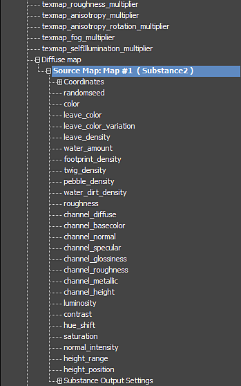

# Animieren von Substance-Material

Sie können Substance-Texturen mit dem Kurveneditor in 3ds Max animieren.

1. Klicken Sie mit der rechten Maustaste auf den Substance2-Knoten, und wählen Sie &quot;Kurveneditor&quot; aus.

   
1. Klicken Sie auf das Pluszeichen (+) auf dem entsprechenden Material, um alle Kanäle anzuzeigen. Die Substance-Parameter finden Sie in den für das Material aufgelisteten Karten. Wenn Sie einen Parameter ändern, wird er auf die gesamte Substance-Textur übertragen, unabhängig davon, welche Texturmap Sie bei der Auswahl des Substance-Parameters zum Animieren auswählen.
1. Scrollen Sie nach unten zu der Stelle, an der die Diffuse-Map angezeigt wird, und klicken Sie auf das Pluszeichen (+), um die Quellzuordnungsparameter anzuzeigen. Hier sehen Sie alle Parameter aus der Substance-Datei.

   
1. Klicken Sie auf den Parameter, den Sie animieren möchten, und klicken Sie dann auf der Symbolleiste auf die Schaltfläche &quot;Taste hinzufügen/entfernen&quot;. Klicken Sie im Kurveneditor auf die Linie, um Keyframes zu platzieren.

   
