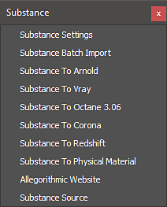

# Verwenden von Workflows im 3ds Max

Das Substance in 3ds Max-Plugin enthält Workflows zum automatischen Erstellen eines Shader-Netzwerks zur Unterstützung von Renderern. Die Render-Arbeitsabläufe finden Sie im Menü Substance .

Um einen Arbeitsablauf zu verwenden, wählen Sie den Substance-Knoten im Material-Editor aus und wählen Sie dann den Arbeitsablauf aus dem Substance-Menü.

