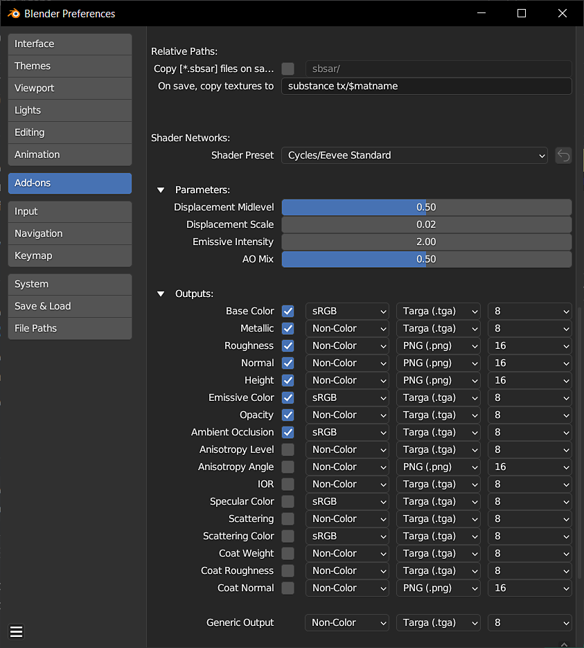

# Substance in Blender - Übersicht

## Übersicht über Plug-ins

Mit dem Substance 3D-Add-on können Sie Substance-Materials in Blender importieren. Im Substance 3D-Bedienfeld können Sie die Substance-Materialien in Ihrem Projekt von einem zentralen Ort aus verwalten und anpassen. Das Add-on generiert Textur Maps aus .sbsar-Dateien und verwendet sie zum Erstellen eines Blender-Materials. Diese Texturen werden automatisch aktualisiert, wenn die Substance-Parameter angepasst werden.

## Importieren von Substance-Material

1. Klicken Sie im Substance 3D-Bedienfeld auf die Schaltfläche **Laden**.
1. Navigieren Sie im daraufhin geöffneten Fenster zum Speicherort der .sbsar-Dateien und wählen Sie eine oder mehrere Dateien aus. Klicken Sie dann auf die Schaltfläche **Substance-Material laden**.
1. Klicken Sie auf das Kugelsymbol im Bedienfeld Material , um das Dropdown-Menü zu öffnen und Ihr Substance-Material auszuwählen. Dadurch wird das Material dem aktuellen Steckplatz zugewiesen. Alternativ können Sie über die Schaltfläche &quot;Anwenden&quot; im Substance 3D-Bedienfeld das Material einem neuen Material-Steckplatz zuweisen, der die aktuelle Zuweisung nicht überschreibt.

>[!NOTE]
>
> Wenn das Objekt keine Material enthält, wird das Substance-Material automatisch über die Schaltfläche **Anwenden** angehängt.

## Das Bedienfeld &quot;Substance 3D&quot;

Mit dem Bedienfeld &quot;Substance 3D&quot; können Sie die Substance-Material in einem Projekt verwalten und ihre individuellen Parameter anpassen. Der Abschnitt &quot;Graf-Parameter&quot; enthält Steuerelemente für die Auflösung der Textur, die Kachelung, die Randomisierung und die Vorgaben. Der Abschnitt &quot;Ausgaben&quot; enthält Steuerelemente für die Bildformate generierter Texturen. Im Abschnitt &quot;Substance-Parameter&quot; können die Substance-Parameter angepasst werden.

Weitere Informationen finden Sie auf der Seite [Substance 3D Panel](../../../3d-applications/blender/the-3d-panel/the-substance-3d-panel.md).

## Voreinstellungen

Standardverhalten und andere Einstellungen können in den Add-On-Voreinstellungen angepasst werden. &quot;Material automatisch anfügen&quot; kann aktiviert werden, um Substance-Materialien automatisch an Objekte anzuhängen und die aktuelle Materialzuweisung zu überschreiben. &quot;Material für ausgewählte Objekte automatisch hervorheben&quot; ändert das im Bedienfeld &quot;Substance 3D&quot; hervorgehobene Material, wenn ein Objekt mit diesem Material ausgewählt wird. Wenn Sie &quot;Zyklen Texturen automatisch aktualisieren&quot; aktivieren, können Texturen im 3D-Viewport aktualisiert werden, während Sie die Zyklen-Renderansicht verwenden.

Versatz kann mit dem Umschalter für Height im Abschnitt &quot;Ausgaben&quot; aktiviert werden. Hier können Sie auch das Dateiformat und die Bittiefe jeder Ausgabe anpassen.

Weitere Informationen finden Sie auf der Seite [Voreinstellungen](../../../3d-applications/blender/preferences/preferences.md).

<table>
<tr style="border: 0;">
<td style="border: 0;" valign="top">

</td>
<td style="border: 0;" valign="top">

</td>
<td style="border: 0;" valign="top">

</td>
</tr>
</table>

## Weitere Substance-Materialien

Tausende von professionell erstellten Materialien und anderen Assets stehen auf der [Substance 3D Assets-Seite](https://helpx.adobe.com/substance-3d/unlisted/assets.html) zum Download zur Verfügung. Viele weitere Elemente, die von der Community kostenlos freigegeben wurden, finden Sie auf der Seite [Substance 3D Community Assets](https://helpx.adobe.com/substance-3d/unlisted/community-assets.html).

## Community

Für allgemeine Hilfe, Rückmeldungen oder Fehlermeldungen können Sie sich dem #substance-blender-beta auf dem [Substance Discord-Server ](https://discord.com/invite/substance3d) oder [Adobe-Communities](https://community.adobe.com/t5/substance-3d-plugins/ct-p/ct-substance-3d-plugins?page=1&sort=latest_replies&lang=all&tabid=all&topics=label-blender) anschließen.
