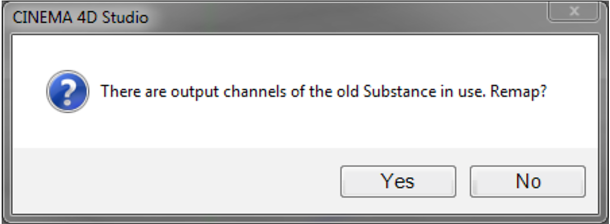

# Attribut-Manager

Es gibt einen neuen Modus für das Substance von Assets im Attributmanager von Cinema 4D.

Wenn Sie im Substance-Asset-Manager eine Substance auswählen, wechselt der Attributmanager automatisch in den Substance-Asset-Modus. Sie können auch manuell in diesen Modus im Menü &quot;Modus&quot; des Attribut-Managers wechseln.

Im Substance-Asset-Modus haben Sie Zugriff auf alle Eingänge einer Substance und Sie haben auch einen Überblick über alle Ausgabekanäle.

{width="500px"}

## Gruppieren von Substance-Eingängen

Wenn Eingaben eines Substance gruppiert sind, werden diese Gruppen als solche im Attributmanager angezeigt. Es gibt zwei vordefinierte Gruppen: **Grundlegende Eigenschaften** und **Bildeingaben**.

* In der Gruppe &quot;Grundlegende Eigenschaften&quot; werden alle Eingaben angezeigt, die keiner Gruppe im Substance Designer zugewiesen wurden.
* Wie der Name bereits andeutet, werden alle Substance-Eingaben, die mit externen Bildern verknüpft sind, in der Gruppe &quot;Bildeingaben&quot; erfasst.

## Dateinamenparameter

Durch Verwenden des Parameters &quot;Dateiname&quot; im Attributmanager kann der Dateispeicherort von Substance-Assets geändert werden, nachdem sie in eine Szene geladen wurden.

{width="500px"}

Dies kann nicht nur beim Verschieben von Substance-Dateien nützlich sein, sondern auch beim Austausch einer Substance mit einer völlig anderen.

In diesem Fall wird der Anwender gefragt, ob vorhandene Verweise auf vorherige Substance-Ausgabekanäle der neuen Substance neu zugeordnet werden sollen.

{width="500px"}

Wenn die Frage mit &quot;Nein&quot; beantwortet wird, werden die Links zur vorherigen Substance von allen Substance-Shadern gelöscht. Um die Ausgabekanäle neu zuzuordnen, sucht das Plug-in zunächst nach Ausgabekanälen desselben Typs und dann mit demselben Namen.

## Parameter Tri-state

Wenn mehrere Substance gleichzeitig ausgewählt sind, werden die von diesen Substance gemeinsam genutzten Eingaben als Tri-State angezeigt und können für alle ausgewählten Substance gleichzeitig bearbeitet werden (wie alle anderen Parameter in Cinema 4D).

In diesen Fällen werden die Ausgabekanäle wie unten gezeigt angezeigt.

{width="300px"}
