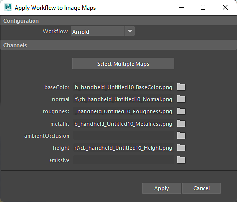

# Workflow auf Karten anwenden

Sie können **Arbeitsablauf auf Karten anwenden** verwenden, um exportierte Texturen aus Substance 3D Painter oder einer beliebigen Malanwendung schnell auf ein Material in Maya anzuwenden.

Mit der Option **Workflow** können Sie auswählen, mit welchem Renderer Sie arbeiten, z. B. Arnold.

Verwenden Sie **Mehrere Maps auswählen**, um mehrere Maps auszuwählen, die auf der Grundlage der links aufgeführten Benennungskonvention angewendet werden sollen. *Zum Beispiel wird \_Raueit dem Rauigkeitskanal zugeordnet.*

Einzelne Karten können hinzugefügt werden, indem Sie auf die Ordnerschaltfläche klicken und die Textur auswählen.
