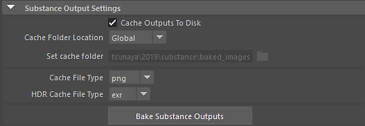

# Substance in Maya - Übersicht

## Übersicht über Plug-ins

Mit dem Substance-Plugin können Sie ein in Substance Designer erstelltes Substance-Material direkt in Maya laden. Das Plugin erstellt ein Maya-Material und speist die Substance-Texturen in die Materialkanäle-Eingänge ein. Sie können dann Änderungen an den Substance-Parametern vornehmen, und die Texturen werden automatisch aktualisiert.

>[!NOTE]
>
> Stellen Sie sicher, dass Sie das Plug-in unter Einstellungen/Voreinstellungen ->Maya Plug-in Manager geladen haben.

## Öffnen einer Substance

1. Öffnen Sie Hypershade, klicken Sie mit der rechten Maustaste im Knoten-Editor und wischen Sie im Markierungsmenü nach oben, um Knoten erstellen auszuwählen. Dadurch wird das Fenster Knoten erstellen geöffnet. Von dort aus können Sie nach dem Substance-Knoten suchen.

   

   Sie können auch im Knoten-Editor auf die Registerkarte klicken und im Textfeld Substanz eingeben. Dies wird nach den Substance-Optionen gefiltert. Wählen Sie in den Optionen &quot;Substance Texture&quot; aus.
1. Wählen Sie den Substance-Knoten und im Eigenschaften-Editor aus, und suchen Sie nach einer Substance-Datei (.sbsar), um sie zu laden.

   
1. Das Dropdown-Menü Ausgewählter Graph wird angezeigt, wenn die Substance mehrere Graphen enthält. Das gewählte Diagramm wird verwendet, um das Material zu erstellen.
1. Die Schaltfläche &quot;Diagramminfo&quot; zeigt die in Substance Designer festgelegten Diagrammattribute an.
1. Legen Sie die Auflösung fest, indem Sie einen Wert in den Dropdown-Feldern &quot;Breite&quot; und &quot;Height&quot; wählen. Die Option &quot;Ration sperren&quot; ist standardmäßig aktiviert.
1. Aktivieren Sie die Option &quot;Cacheausgaben auf Festplatte&quot;, um die Substance-Ausgaben auf der Festplatte zu backen, damit sie mit Renderern wie Arnold verwendet werden können. Die zwischengespeicherte Datei wird vom Plugin über einen Maya-Dateiknoten wieder eingelesen.

   
1. Wählen Sie einen Arbeitsablauf für den verwendeten Renderer aus und klicken Sie auf die Schaltfläche Shader-Netzwerk erstellen. Für den Renderer-Workflow wird ein Shader-Netzwerk erstellt. Sie können nun das Material in der Szene anwenden.

   {width="1000px"}
