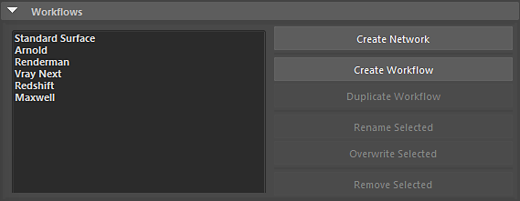
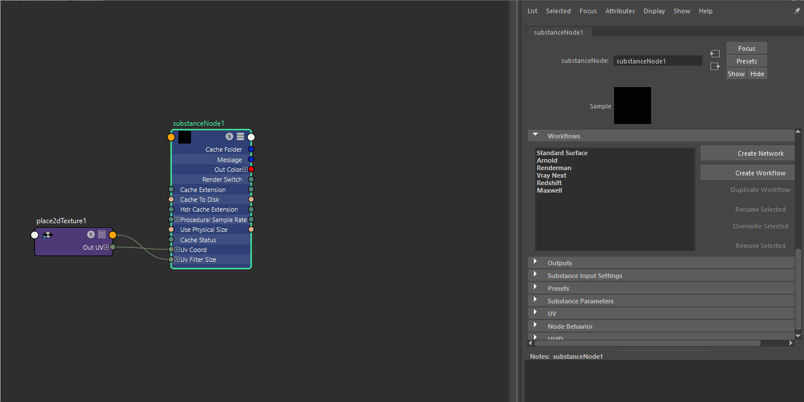

# Verwenden von Workflows

Unter Workflows können Sie Render-Vorgaben für Substance-Ausgaben auswählen oder erstellen. Diese Vorgaben sind Shader-Netzwerke für einen Renderer wie Arnold oder Vray.

>[!NOTE]
>
> **Speicherort der Workflowvorgabe**
> 
> **Windows**:\
> C:\Users\\Documents\maya\2022\substance\workflows\generated\
> **MacOS**:\
> /Benutzer//Library/Preferences/Autodesk/maya//substance/workflows/generated\
> **Linux**:\
> /home/maya/content/workflows/generated

Um einen Arbeitsablauf zu verwenden, wählen Sie einfach die Vorgabe aus der Dropdown-Liste aus und klicken Sie dann auf die Schaltfläche Shader-Netzwerk erstellen .

## Erstellen eines Workflows

Sie können Ihren eigenen Arbeitsablauf erstellen und ihn der Liste Renderer-Arbeitsablauf hinzufügen. Beim Hinzufügen eines neuen Workflows werden alle Knoten, die nach dem Substance-Knoten erstellt wurden, im Workflow gespeichert. Auf diese Weise können Sie eine beliebige Anzahl von Schattierung-Knoten erstellen, um ein vollständiges benutzerdefiniertes Shader-Netzwerk zu erstellen, das als voreingestellter Workflow gespeichert werden kann.

##  Verwalten von Arbeitsabläufen

### Speichern benutzerdefinierter Workflows

1. Erstellen Sie manuell Substance-Ausgänge und verbinden Sie sie mit einem Material wie aiStandardSurface.
   1. Sie können beliebige Maya-Knoten verwenden oder bestimmte Knoten rendern, um das Shader-Netzwerk zu erstellen.
1. Klicken Sie auf die Schaltfläche **Arbeitsablauf erstellen**, und geben Sie einen Namen für die Arbeitsablaufvorgabe ein.

### Duplizieren von Workflows

Sie können einen Arbeitsablauf duplizieren, indem Sie auf die Schaltfläche **Arbeitsablauf duplizieren** klicken.

### Arbeitsabläufe zum Umbenennen und Überschreiben

Sie können vorhandene Workflows umbenennen und Workflows mit aktualisierten Daten überschreiben, indem Sie die Schaltflächen **Umbenennen** und **Überschreiben** verwenden.

### Entfernen von Workflows

Sie können vorhandene Workflows entfernen, indem Sie die Schaltfläche &quot;Arbeitsablauf entfernen&quot; verwenden.
