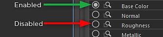

# Arbeiten mit Ausgaben

Sie können Ausgaben manuell im Abschnitt &quot;Ausgaben&quot; aktivieren/deaktivieren.

{width="800px"}

Ein geschlossener Kreis zeigt an, dass die Ausgabe erstellt wurde. In der Abbildung oben können Sie sehen, dass die Grundfarbe erstellt wurde. Da &quot;Cacheausgabe auf Festplatte&quot; aktiviert war, wurde sowohl eine Substance-Ausgabe als auch ein Maya-Dateiknoten erstellt. Der Dateiknoten liest die zwischengespeicherte Textur auf der Festplatte ein und wird automatisch aktualisiert, wenn das Substance Engine die Texturen verarbeitet. Klicken Sie erneut auf den geschlossenen Kreis, um die Ausgabe zu deaktivieren und die Knoten zu entfernen.

Klicken Sie auf das Brillensymbol, um die Substance-Ausgabe oder den Dateiknoten auszuwählen. Wenn der Dateiknoten erstellt wurde, wird er beim Klicken auf das Brillensymbol ausgewählt. Wenn kein Dateiknoten vorhanden ist, wird die Substance-Ausgabe ausgewählt. Dadurch können Sie schnell zu einem Ausgabe- oder Dateiknoten navigieren. *\*Tipp: Drücken Sie die Taste &quot;F&quot;, um den ausgewählten Knoten im Knoten-Editor zu rahmen. Dies ist praktisch, wenn Sie viele Ausgaben haben und einen bestimmten Dateiknoten suchen müssen.*
