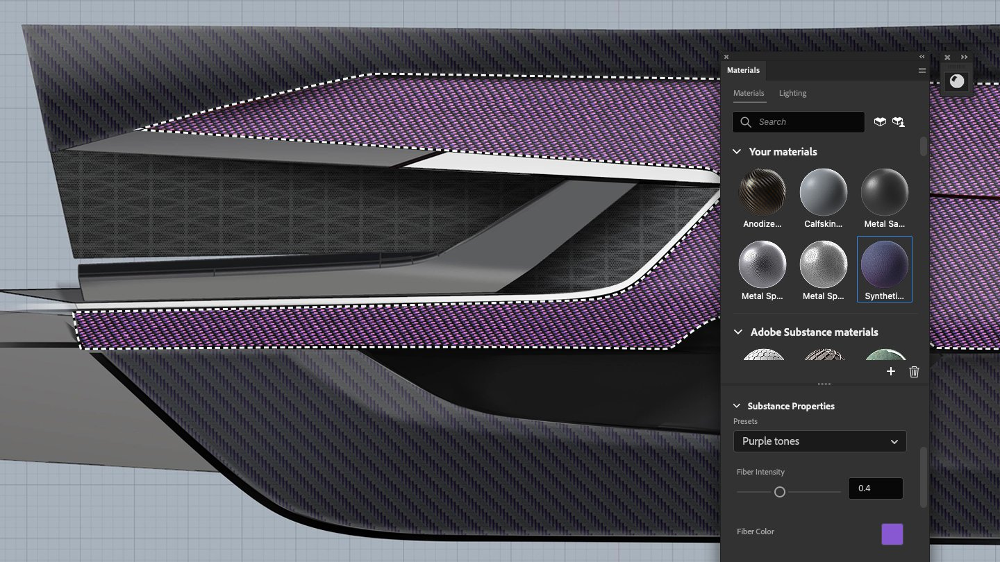

# Photoshop

Das Substance 3D Material-Plug-in für Photoshop ist ein leistungsstarkes Tool, mit dem Sie .sbsar-Dateien importieren und als parametrische Materialien in Ihren Projekten verwenden können. Substance-Materialien bieten im Vergleich zu den nativen Mustern von Photoshop erweiterte Anpassungsoptionen. So kannst du mit nur einem Klick realistische 3D-Texturen anwenden und Einstellungen wie Muster, Farben und sogar die Beleuchtung anpassen.

Weitere Informationen finden Sie in den [Adobe Substance 3D-Materialien für Photoshop HelpX auf der Seite &#x200B;](https://helpx.adobe.com/photoshop/using/substance-3d-materials-for-photoshop.html).
