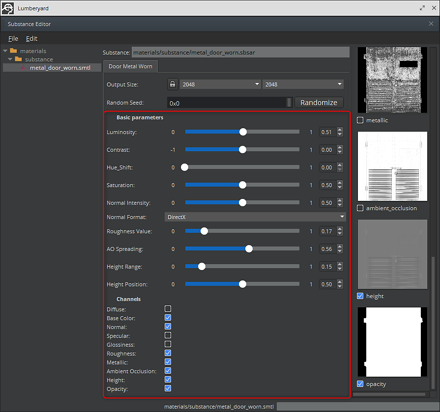

# Parameter und Ausgaben

Sie können den Editor für prozedurale Materialien verwenden, um die Parameter einer Substanz zu ändern. In der linken Spalte des Dialoges werden die Stoffe aufgelistet. In der mittleren Spalte des Dialogfelds werden die Parameter für die ausgewählte Substanz aufgeführt, in der rechten Spalte die Ausgaben für die ausgewählte Substanz. Die Ausgabe kann durch Klicken auf das Kontrollkästchen aktiviert und deaktiviert werden.

1. Öffnen Sie den Editor für prozedurale Materialien, und wählen Sie die Substanz aus. Wählen Sie die Substanz in der linken Spalte aus. Die Parameter werden in der mittleren Spalte zusammen mit den zugehörigen Ausgaben für die Substanz in der Spalte ganz rechts geladen.

   
1. Sie können auch andere Substance-Ausgaben aktivieren, die nicht standardmäßig aktiviert sind, um die Texturen zu erstellen.

   
1. Nachdem Sie die Änderungen vorgenommen haben, speichern Sie die Materialeinstellungen mit Datei > Speichern.
