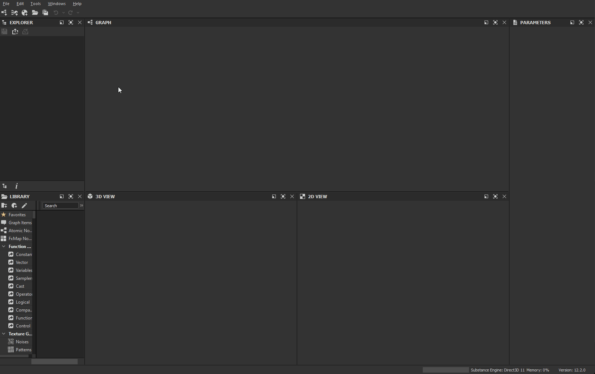

# Roblox

[Roblox](https://www.roblox.com/) ist eine Plattform für immersive 3D-Multiplayer-Erlebnisse. Roblox Studio, das Roblox-Designtool, unterstützt den PBR-Metallische Rauheit-Workflow.

<table>
<tr style="border: 0;">
<td width="58.30%" style="border: 0;" valign="top">

## Substance 3D Designer-Vorlage

Um Texturen für Roblox zu erstellen, können Sie die Substance 3D-Datei unten als [Substance-Compositing-Graf](https://experienceleague.adobe.com/de/docs/substance-3d-designer/using/substance-graphs/substance-compositing-graphs)-Vorlage in [Substance 3D Designer](https://experienceleague.adobe.com/en/docs/substance-3d-designer/home) verwenden.

[{width="64px"}](https://helpx.adobe.com/content/dam/roblox.sbs)

Diese Graf-Vorlage ermöglicht die Vorkonfiguration der Dateinamen und Typen der endgültigen Textur. Diese Vorlage kann installiert und wiederverwendet werden, um neue Material zu erstellen, die immer den Roblox-Material-Richtlinien entsprechen.

</td>
<td width="41.60%" style="border: 0;" valign="top">

{width="200px"}

</td>
</tr>
</table>

## Workflow von Designer zu Roblox

<table>
<tr style="border: 0;">
<td style="border: 0;" valign="top">

### Vorlage installieren

Zunächst *installieren* Sie die Roblox-Vorlage.

* Laden Sie die oben verknüpfte Vorlagendatei herunter.
* Rufen Sie das Benutzerdokumentverzeichnis von Designer auf:
* (Creative Cloud-Desktop) `/Documents/Adobe/Adobe Substance 3D Designer`\
  (Steam) `/Documents/Allegorithmic/Substance Designer/`
* Erstellen Sie einen Vorlagenordner.
* Platzieren Sie die Datei in diesem Ordner.

</td>
<td style="border: 0;" valign="top">

{width="512px"}

</td>
</tr>
</table>

<table>
<tr style="border: 0;">
<td style="border: 0;" valign="top">

### Vorlage erkennen

Lassen Sie dann Designer *den Vorlagenordner überwachen*, um nach Graf-Vorlagen zu suchen.

* Wechseln Sie in Designer zu **Bearbeiten > Voreinstellungen...1**
* Wechseln Sie im Fenster [Voreinstellungen](https://experienceleague.adobe.com/de/docs/substance-3d-designer/using/workspace/preferences/preferences-window) zu **Projekte > Benutzerprojekt > Allgemein**
* Klicken Sie in der Liste **Vorlagenverzeichnisse** auf die Schaltfläche **+**.
* Wechseln Sie zum Verzeichnis `templates` und klicken Sie auf **Ordner auswählen**.
* Klicken Sie auf die Schaltfläche **OK**.
* Wechseln Sie zu **Datei > Neu > Substance-Graf...1**
* Überprüfen Sie, ob die Vorlage &quot;`Roblox`&quot; im Fenster &quot;[Neuer Substance-Graf](https://helpx.adobe.com/de/substance-3d/unlisted/documentation/sddoc/create-a-graph-102400068.html)&quot; unten in der Vorlagenliste aufgeführt ist.

</td>
<td style="border: 0;" valign="top">

{width="512px"}

</td>
</tr>
</table>

<table>
<tr style="border: 0;">
<td style="border: 0;" valign="top">

### Texturen exportieren

Erstellen Sie mithilfe der Roblox-Vorlage einen Graf und exportieren Sie Bitmaps aus diesem Graf, sobald Sie die Arbeit an einem Material abgeschlossen haben.

* Wählen Sie im Fenster [Neuer Substance-Graf](https://helpx.adobe.com/de/substance-3d/unlisted/documentation/sddoc/create-a-graph-102400068.html) die Vorlage `Roblox` aus.
* Legen Sie eine beliebige Identifizierung und andere Parameter für den Graf fest und klicken Sie auf **OK**.
* Arbeiten Sie an Ihrem Material in der [Graphansicht](https://experienceleague.adobe.com/de/docs/substance-3d-designer/using/workspace/graph-view/the-graph-view). Lesen Sie [hier](https://experienceleague.adobe.com/de/docs/substance-3d-designer/using/getting-started/workflow-overview), um mit dem Arbeitsablauf zu beginnen.
* Wenn Sie fertig sind, gehen Sie zu **Tools > Bitmaps exportieren...** in der Graphansicht *Symbolleiste*
* Legen Sie im Fenster [Bitmaps exportieren](https://experienceleague.adobe.com/de/docs/substance-3d-designer/using/substance-graphs/exporting-bitmaps) einen gültigen Pfad **Ziel** fest. Stellen Sie sicher, dass *alle* die Ausgaben *aktiviert* sind, und klicken Sie auf **Exportieren**.
* Überprüfen Sie, ob die Texturen ordnungsgemäß in den Pfad **Ziel** exportiert wurden.

</td>
<td style="border: 0;" valign="top">

{width="512px"}

</td>
</tr>
</table>

<table>
<tr style="border: 0;">
<td style="border: 0;" valign="top">

### Material in Roblox erstellen

Erstellen Sie in Roblox ein Material Variant und weisen Sie die aus Designer exportierten Texturen zu.

* Wählen Sie die Registerkarte **Material** aus, und klicken Sie auf **Modellmanager**.
* Wählen Sie eine *Material-Vorlage* aus, und klicken Sie auf die Schaltfläche **Variante erstellen**.
* Legen Sie im Fenster **Variante** erstellen einen Namen für das Material fest.
* Klicken Sie für *jeden Material-Kanal* auf die Schaltfläche **Importieren** und wählen Sie die entsprechende aus Designer exportierte Textur aus.
* Klicken Sie auf **Speichern**.

</td>
<td style="border: 0;" valign="top">

{width="512px"}

</td>
</tr>
</table>

<table>
<tr style="border: 0;">
<td style="border: 0;" valign="top">

### Material anwenden

Verwenden Sie Ihre neue Material-Variante in Ihrer Roblox-Szene

* *Wählen Sie* beliebige Teile oder Mesh in Ihrer Roblox-Szene aus
* Wählen Sie im **Material-Manager** Ihre *Material-Variante* aus, und klicken Sie auf die Schaltfläche **Auf ausgewählte Teile anwenden**

>[!NOTE]
>
> Wenn die Texturen in Roblox anders aussehen, überprüfen Sie das **Color**-Attribut in den Eigenschaften des Objekts, auf das der Material-Variant angewendet wird, unter der **Kategorie Erscheinungsbild** und stellen Sie sicher, dass es auf *Reinweiß* festgelegt ist - d. h. auf RGB (255, 255, 255), das in Roblox mit *Institutionelles Weiß* gekennzeichnet ist.

</td>
<td style="border: 0;" valign="top">

{width="512px"}

</td>
</tr>
</table>

<table>
<tr style="border: 0;">
<td style="border: 0;" valign="top">

### Kachelung anpassen

Der Wiederholungsgrad des Materials auf einer Fläche - d.h. die Kachelung - kann jederzeit eingestellt werden.

* Wählen Sie im **Material-Manager** Ihre *Material-Variante* aus, und klicken Sie auf die Schaltfläche **Bearbeiten**
* Passen Sie im Fenster &quot;**Variant bearbeiten**&quot; den Wert der Eigenschaft &quot;**Studs pro Kachel**&quot; unter &quot;**Additional**&quot; an - ein *Lower*-Wert führt zu *more*-Wiederholung

</td>
<td style="border: 0;" valign="top">

{width="512px"}

</td>
</tr>
</table>
