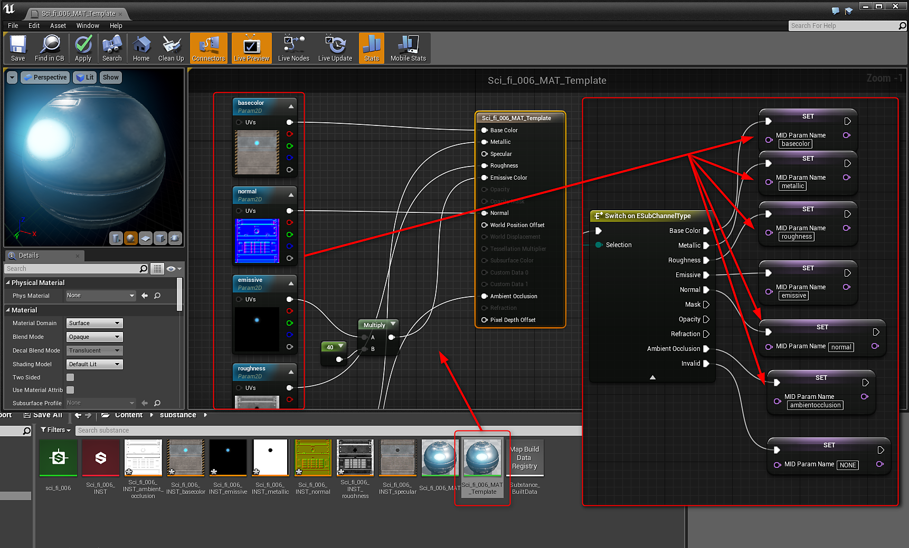

# Blueprint(UE4): Instanz des dynamischen Materials

Sie können eine Instanz des Substance-Grafen erstellen, um zur Laufzeit eine dynamische Grapheninstanz zu erstellen.

1. Erstellen Sie eine Variable vom Typ Substance Instance Factory und setzen Sie den Standardwert auf Imported Substance Factory.
1. Fügen Sie einen Knoten Grapheninstanz erstellen hinzu und schließen Sie die Substance Instance Factory an die Factory-Eingabe an. Legen Sie einen Instanznamen fest.
1. Erstellen Sie eine weitere Variable vom Typ Substance Instance Factory. Dies enthält Verweise auf das dynamische Substance-Material.
1. Legen Sie die Variable für das dynamische Substance-Material mit dem Rückgabewert des Knotens &quot;Grapheninstanz erstellen&quot; fest.
1. Erstellen Sie eine Variable vom Typ Material. Dies wird die Vorlage für das Material sein. Erstellen Sie im Inhaltsbrowser ein Duplikat des von der Substance generierten UE4-Materials. Legen Sie dieses duplizierte Material als Eingabe für die Material-Vorlagenvariable fest.
1. Fügen Sie eine Instanz des Typs &quot;Dynamisches Material erstellen&quot; hinzu und legen Sie die Variable &quot;Material-Vorlage&quot; als übergeordnete Variable fest.

   {width="800px"}
1. Erstellen Sie eine Variable vom Typ Material. Dies ist die Material Instance Dynamic (MID). Legen Sie den Rückgabewert der Instanz des dynamischen Materials auf die Variable fest.

   {width="800px"}
1. Fügen Sie einen Knoten &quot;Material festlegen&quot; hinzu und legen Sie den Wert der Variablen &quot;MID&quot; als Material-Eingabe fest. Legen Sie es für das Ziel auf das Objekt fest, auf das Sie das Material anwenden möchten.
1. Erstellen Sie eine Variable vom Typ Name. Diese Variable enthält den Namen für die im Material festgelegten Kanäle. Initialisieren Sie dies mit dem Wert &quot;NONE&quot;.
1. Fügen Sie einen Knoten Substance-Texturen abrufen hinzu und legen Sie die Grapheninstanz auf die Variable Dynamic Grapheninstanz fest.
1. Fügen Sie einen Knoten für die For-Schleife hinzu. Hier werden die Substance Texturen durchlaufen. Nehmen Sie das Ergebnis der Get Substance Textures als Eingabe-Array.

   {width="800px"}
1. Fügen Sie einen Substance Get Channel-Knoten mit dem Arrayelement aus der for-Schleife als Eingabe hinzu.
1. Fügen Sie einen Sequenzknoten hinzu. Hier wird zuerst das Ergebnis des Knotens &quot;Get Channel&quot; ausgeführt.
1. Fügen Sie einen Switch on ESubChannelType nach der Sequenz Then 0 mit dem Rückgabewert Get Channel als Selection hinzu. Hier überprüfen wir die Namen der Kanäle.
1. Setze die Variable &quot;MID Name&quot; auf die Kanalnamen im duplizierten Substance-Material aus Schritt 5. *Siehe das Materialbild.*
1. Im Knoten Sequenz Dann 1 richten Sie den Prozess der Zuweisung der Kanalnamen zum dynamischen Material ein.
1. Rufen Sie die Variable mit dem MID-Namen ab und fügen Sie einen Knoten mit der gleichen Zeichenfolge mit dem Wert &quot;NONE&quot; hinzu. Dies ist der Wert, der die Variable initialisiert.
1. Fügen Sie einen Verzweigungsknoten mit der Bedingung aus dem Knoten Gleichmäßig hinzu.
1. Fügen Sie einen Substance-Wert zum Festlegen von Texturparametern hinzu. Das Ziel ist die MID-Variable und der Parametername die MID-Namensvariable. Der Wert ist das Arrayelement aus dem ForEachLoop-Knoten.

{width="800px"}
