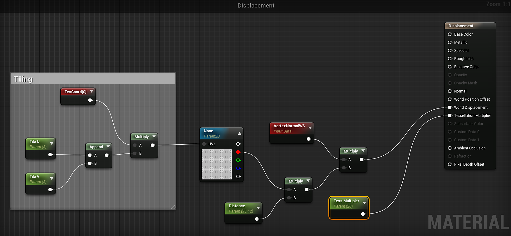

# Arbeiten mit Versatz - UE4

Um mit Versatz arbeiten zu können, müssen Sie die Tessellation auf Ihrem Material aktivieren.

{width="600px"}

Um die Height-Ausgabe zu verwenden, müssen Sie auf die Ausgabe in der Substance Factory Instance doppelklicken, um Height zu erstellen. Height ist standardmäßig nicht aktiviert. Sie können diese Materialausgabe dann in Ihr Height ziehen.

{width="800px"}

Nachdem Sie die Height-Ausgabe zu Ihrem Material hinzugefügt haben, müssen Sie einige Knoten erstellen, um den World Versatz und den Tessellation Modifier zu steuern.

1. Erstellen Sie zwei skalare Parameter. Das eine ist die Entfernung und das andere der Multiplikator für die Tessellation.
1. Multiplizieren des Rotkanals vom Height mit dem Parameter &quot;Abstand&quot;
1. Fügen Sie einen VertexNormalWS -Knoten hinzu und multiplizieren Sie diesen mit der Ausgabe der Multiplikation in Schritt 2.
1. Geben Sie die Multiplikation von VertexNormal in den Versatz World auf dem Material ein.
1. Nehmen Sie den Multiplikator für die Tessellation und geben Sie ihn in den Multiplikator für die Tessellation des Materials ein.

{width="800px"}

>[!NOTE]
>
> Die anderen Textur-Ausgaben wurden in diesem Bild weggelassen, um den Graf zu vereinfachen. Hier sind nur die Versatz- und Multiplikatorknoten zur Verdeutlichung dargestellt.
