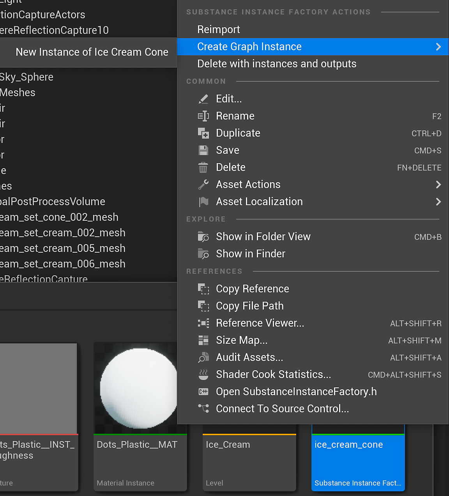

# Materialinstanzdefinition - UE5

Sie können UE5 Material Instances mit Substance verwenden. Dadurch wird ein großer Schritt im GPU-Rendering-Prozess gespeichert, indem kein neues Material in den Prozess hochgeladen wird. Eine MID kann zur Laufzeit oder im Editor erstellt werden. Mit Version 5.0.0 haben wir die volle Unterstützung für Material-Instancing hinzugefügt.

## Erstellen einer Material-Instanz im Editor

1. Klicken Sie mit der rechten Maustaste auf das UE5-Material des erstellten Stoffes und wählen Sie &quot;Material-Instanz erstellen&quot;. Dadurch wird ein UE5-Instanz-Material erstellt.

   
1. Mache einen Rechtsklick bzw. Ctrl-Klick auf die Substance Instance Factory, und wähle &quot;Grapheninstanz erstellen&quot;. Dadurch wird eine Instanz des Grafen und ein weiteres UE5-Material erstellt. Löschen Sie das neu erstellte UE5-Material, da es nicht verwendet wird.

   
1. Doppelklicken Sie auf die Material-Instanz, die Sie in Schritt 1 erstellt haben, und aktivieren Sie die Parameter für die Textur aller Maps.
1. Legen Sie die Textur auf die neue INST-Textur fest, die in Schritt 2 erstellt wurde. Dadurch wird die Instanz des Materials so festgelegt, dass die Substance-Ausgabemaps aus dem instanzierten Graf verwendet werden.

   

Sie haben jetzt eine UE5-Material-Instanz, die eine bestimmte Gruppe von Substance-Texturen verwendet. Dies ist eine optimierte Art, mit mehreren Substanzen in einem UE5-Projekt zu arbeiten. Um zu erfahren, wie Sie eine MID mithilfe von Blueprint erstellen, lesen Sie bitte diese Seite. [Blueprint(UE5): Dynamische Materialinstanz ](https://helpx.adobe.com/substance-3d/unlisted/documentation/integrations/blueprint-dynamic-material-instance-152535142.html)
