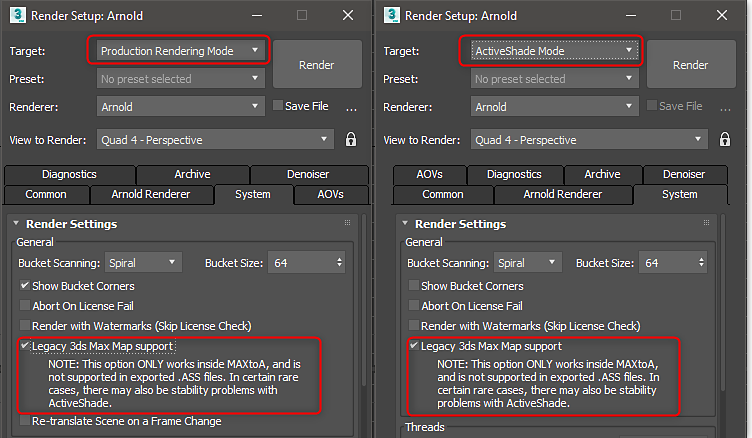

# Arnold - Substance in 3ds Max

>[!NOTE]
>
> Sie müssen die Legacy 3ds Max Map-Unterstützung für das Substance von Texturen aktivieren, um mit Arnold arbeiten zu können

## Substance in 3ds Max Plugin

Mit dem [3ds Max-Plugin](../../../3d-applications/3ds-max/3ds-max.md) können Sie im Substance-Menü &quot;Arnold&quot; auswählen, um das Arnold-Material automatisch mit Substance-Textureingaben einzurichten.

## Unterstützung für ältere Karten

Legacy-Kartenunterstützung muss für Produktions- und ActiveShade-Renderings aktiviert werden.

>[!WARNING]
>
> Der GPU-Renderer wird von Substance Textures nicht unterstützt, wenn ActiveShade verwendet wird.

