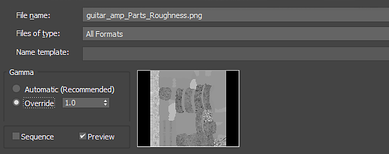

# Substance Texturen in 3ds Max

Das Substance in 3ds Max Plugin kümmert sich um die Gamma-Einstellung für Ausgänge.

Beim Importieren von Texturen müssen Sie Gamma auf Override1.0 für Bilder festlegen, die Nicht-Farbdaten wie metallic, Rauheit, Normal, Height und Versatz darstellen.

