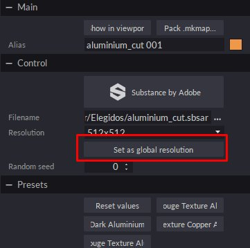

# Substance SBSAR-Integration

**Sie können** **leicht**&#x200B;**bringen** **SBSAR-Dateien** **erstellt** **im Substance Designer oder Substance** **Alchemist** **bis** **Maverick &#x200B;**&#x200B;**nach**&#x200B;**entweder** **von** **diese** **2** **Methoden**&#x200B;**:**

**Methode** **1:**

1. Verwenden Sie das SBSAR-Symbol und wählen Sie Ihre SBSAR-Datei aus.

   
1. Im Dialogfeld &quot;Importieren&quot; können Sie einige Materialparameter festlegen:

   
1. Wenn du fortfährst, wird dein Material im Bedienfeld &quot;Materialien&quot; angezeigt und kann in deiner Szene verwendet werden:

   

   **Methode** **2**&#x200B;**:**
1. Platziere einfach deine SBSAR-Datei im Windows Explorer an einem beliebigen Objekt in der Szene. Sie können SBSAR-Dateien auch im Bedienfeld &quot;Material&quot; ablegen.
1. Im Dialogfeld &quot;Importieren&quot; können Sie einige Materialparameter festlegen:

   
1. Das Material wird auf das Objekt angewendet, auf das Sie gefallen sind.

   **Tipps und Tricks:**
1. Du kannst die SBSAR-Parameter bearbeiten, indem du den Substance-Knoten im Bedienfeld &quot;Materialien&quot; auswählst oder auf einen der Kanal-Plug-ins des Materials klickst.
1. Es wird empfohlen, das Material mit einer Auflösung von 512 oder 1024 zu bearbeiten, um die Bearbeitung flüssiger zu gestalten. Für das finale Rendering können Sie die Auflösung auf 2048 oder 4096 erhöhen.
1. Wenn du dieselbe SBSAR mit unterschiedlichen Parametern auf ein anderes Objekt in der Szene anwenden möchtest, dupliziere sie und wende sie auf das neue Objekt an. Maverick erstellt automatisch ein neues Material, das du unabhängig voneinander bearbeiten kannst.
1. Wenn du mehrere SBSARs in der Szene hast, kannst du den Button &quot;Als globale Auflösung festlegen&quot; in einem dieser SBSARs verwenden, um die Auflösung aller SBSARs gleichzeitig zu steuern.

   
1. Maverick enthält 10 Materialien und SBSARs, die Sie in der Kartenbibliothek unter der Schattierung &quot;Materials/Substance&quot; und unter den Ordnern &quot;Maps/Sbsar&quot; finden können:

   
1. Wenn Sie Ihre eigenen SBSARs Maverick zur Verfügung stellen möchten, erstellen Sie einen Unterordner, in dem Sie sie ablegen können

   &quot;C:\Users\User\Documents\RandomControl\library\Shading\My Maps&quot;.

   Dann kannst du sie einfach über deine Objekte legen, damit Maverick das entsprechende Wrapper-Material erstellen kann.

   Ein Einführungsvideo für SBSAR in Maverick finden Sie hier: <https://youtu.be/HosZOoMRfcM>

   Hier sehen Sie ein praktisches Beispiel für die Verwendung von SBSAR in Maverick: <https://youtu.be/ebVI5jJD71A>

   **Support** **Links:**

   Mail an [gorilla@maverickrender.com](https://helpx.adobe.com/mailto:gorilla@maverickrender.com)

   Chatten auf der Maverick-Website [www.maverickrender.com](http://www.maverickrender.com/)
