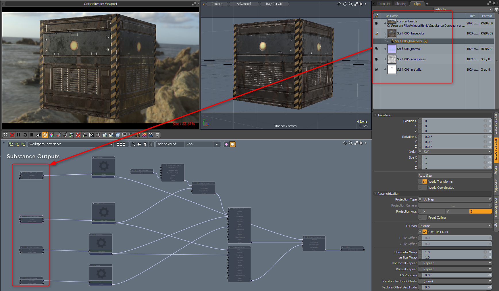

# Oktan für MODO

## Substance in MODO-Plug-in

Die Substance-Ausgaben funktionieren nativ mit Octane. Sie können die folgenden Substance-Ausgaben und Texturebenen-Effektkonfigurationen verwenden.

1. Erstelle eine Substance > Struktur > Substance erstellen. Wähle als Modus &quot;Unreales Material&quot;. Wenn du die Option &quot;Unrealistisches Material&quot; verwendest, kannst du die Struktur im Viewport &quot;Erweitertes OGL&quot; anzeigen.
1. Erstellen Sie Ausgaben für Grundfarbe, Metallisch, Raueit und Normal.
1. MODO verwendet OGL Normal-Karten. In den Substance-Eigenschaften müssen Sie die Normalrichtung in OpenGL ändern.

   
1. Laden Sie die Substance PBR-Vorgabe. Diese Vorgabe ist ein &quot;Octane Override&quot;. Ziehe die Vorlage in deine Shader-Gruppe.

   [Substance\_PBR.lxp](https://helpx.adobe.com/content/dam/help/en/substance-3d/documentation/integrations/files/162005234/162005272/1/1502792782697/substance-pbr.lxp)
1. Wählen Sie das irreguläre Format aus und ziehen Sie die Substance-Ausgaben aus dem Clip-Browser in die Schemaansicht. Nehmen Sie den Knoten mit der Dateinamenausgabe und verbinden Sie ihn mit dem entsprechenden Eingabeknoten, d. h. Grundfarbe → Grundfarbe.

   
1. Alle anderen Substance-Ausgänge anschließen

   {width="640px"}
